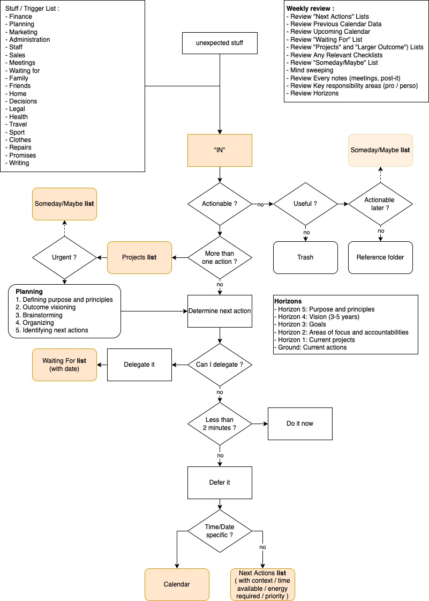
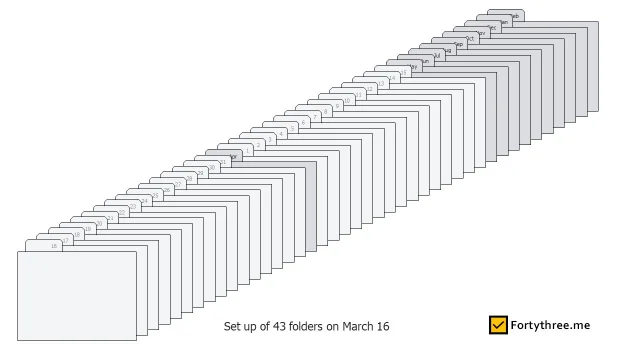
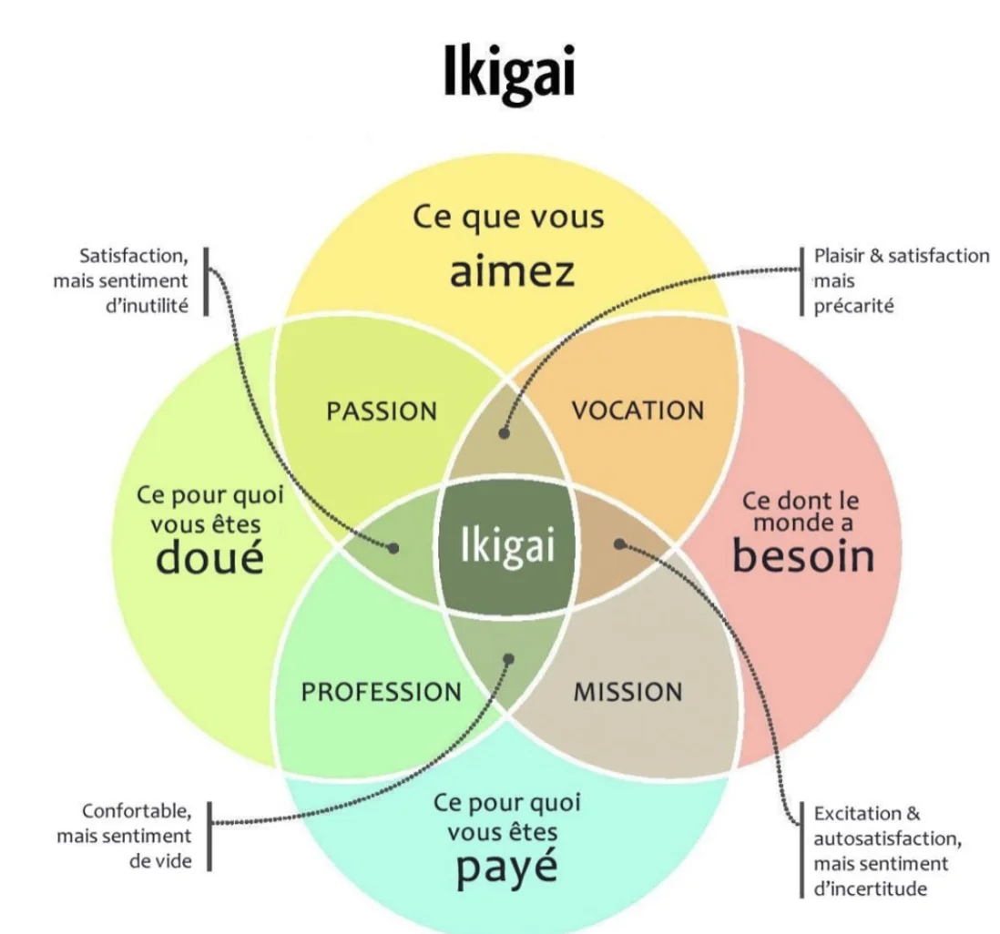

# Getting Things Done (the art of stress-free productivity) | S'organiser pour réussir (La méthode GTD ou l'art de l'efficacité sans le stress)

> Getting Things Done - David ALLEN [2015] - ISBN: 978-0-143-12656-0

> S'organiser pour réussir - David ALLEN [2008] - ISBN: 978-2-84899-209-9

- 16/05/2022

## Resources

- <https://www.newyorker.com/tech/annals-of-technology/the-rise-and-fall-of-getting-things-done>

> In this context, the shortcomings of personal-productivity systems like G.T.D. become clear. They don’t directly address the fundamental problem: the insidiously haphazard way that work unfolds at the organizational level. They only help individuals cope with its effects. A highly optimized implementation of G.T.D. might have helped Mann organize the hundreds of tasks that arrived haphazardly in his in-box daily, but it could do nothing to reduce the quantity of these requests.

- [GTD in 15 minutes – A Pragmatic Guide to Getting Things Done](https://hamberg.no/gtd/) ([wayback archive](https://web.archive.org/web/20220514051100/http://hamberg.no/gtd/)) ([PDF](./files/GTD_in_15_minutes_A_Pragmatic_Guide_to_Getting_Things_Done.pdf))
- [How I GTD](https://thepenguin.eu/2018-09-26-how-i-gtd/) ([wayback archive](https://web.archive.org/web/20220808215212/https://thepenguin.eu/2018-09-26-how-i-gtd/))
- [GTD for academics](https://rtalbert.org/gtd-for-academics-simple-trusted-system/) ([wayback archive](https://web.archive.org/web/20220819070521/https://rtalbert.org/gtd-for-academics-simple-trusted-system/))

## 2015 english updated edition

### Table of contents

- Part 1: The Art of Getting Things Done
  - Chapter 1: A New Practice for a New Reality
  - Chapter 2: Getting Control of Your Life: The Five Stages of Mastering Workflow
  - Chapter 3: Getting Projects Creatively Under Way: The Five Phases of Project Planning
- Part 2: Practicing Stress-Free Productivity
  - Chapter 4: Getting Started: Setting Up the Time, Space, and Tools
  - Chapter 5: Collection: Corralling Your "Stuff"
  - Chapter 6: Processing: Getting "In" to Empty
  - Chapter 7: Organizing: Setting Up the Right Buckets
  - Chapter 8: Reviewing: Keeping Your System Functional
  - Chapter 9: Doing: Making the Best Action Choices
  - Chapter 10: Getting Projects Under Control
- Part 3: The Power of the Key Principles
  - Chapter 11: The Power of the Collection Habit
  - Chapter 12: The Power of the Next-Action Decision
  - Chapter 13: The Power of Outcome Focusing

### Notes

+ [PDF version](./files/GTD_complete.pdf)

#### Introduction

> Two of my tests for a book are whether I remember it a month or two after I have read it, and whether it affects my view of the world
>
> -- <cite>James FALLOWS</cite>

An email request means essentially the same thing and has to be processed the same way as a favor asked of you at the coffee machine.

- _footnote_ : An excellent resource in this area is Charles DUHIGG's book, "The Power of Habit".

#### Welcome to Getting Things Done

If you're like me, you like getting things done and doing them well, and yet you also want to savor life in ways that seem increasingly elusive, if not downright impossible, if you're working too hard.

> As to methods there may be a million and then some, but principles are few. The man who grasps principles can successfully select his own methods. The man who tries methods, ignoring principles, is sure to have trouble.
>
> -- <cite>Ralph Waldo Emerson</cite>

> Anxiety is caused by a lack of control, organization, preparation, and action.
>
> -- <cite>David Kekich</cite>

#### Part 1. The art of Getting Things Done

The methods I present here are all based on three key objectives: (1) capturing all the things that might need to get done or have usefulness for you - now, later, someday, big, little, or in between in a logical and trusted system outside your head and off your mind; (2) directing yourself to make front-end decisions about all of the "inputs" you let into your life so that you will always have a workable inventory of "next actions that you can implement or renegotiate in the moment; and (3) curating and coordinating all of that content, utilizing the recognition of the multiple levels of commitments with yourself and others you will have at play, at any point in time.

Almost everyone I encounter these days feels he or she has too much to handle and not enough time to get it all done.

A paradox has emerged in this new millennium: people have
enhanced quality of life, but at the same time they are adding to
their stress levels by taking on more than they have resources to
handle.

The relative speed of changes in our cultures, lifestyles, and technologies are creating greater necessity for individuals to take more control of their unique personal situations more often.

##### The basic requirements for managing commitments

- First of all, if it's on your mind, your mind isn't clear. Anything you consider unfinished in any way must be captured in a trusted system outside your mind, or what I call a collection tool, that you know you'll come back to regularly and sort through.
- Second, you must clarify exactly what your commitment is and decide what you have to do, if anything, to make progress toward fulfilling it.
- Third, once you've decided on all the actions you need to take, you must keep reminders of them organized in a system you review regularly.

> You must use your mind to get things off your mind.

- Describe, in a single written sentence, your intended successful outcome for this problem or situation. In other words, what would need to happen for you to check this project off as "done" ?

> operational principle: you have to think about your stuff more
than you realize but not as much as you're afraid you might.

##### why things are on your mind

- you haven't clarified exactly what the intended outcome is ;
- you haven't decided what the very next physical action step is ; and/or
- you haven't put reminders of the outcome and the action required in a system you trust.

##### the transformation of "stuff"

The reason most organizing systems haven't worked for most people is that they haven't yet transformed all the stuff they're trying to organize.

They were partial reminders of a lot of things that were unresolved and as yet untranslated into outcomes and actions--that is, the real outlines and details of what the list maker had to do.

"Decide about me!" And if you do not have the energy or focus at the moment to think and decide, it will simply remind you that you are overwhelmed.

because of lack of definition of the specific outcomes desired and actions required.

Getting things done requires two basic components: defining (1) what "done' means (outcome) and (2) what "doing looks like (action).

##### The major change: getting it all out of your head

There is no reason to ever have the same thought twice, unless you like having that thought.

##### Chapter 2 | Getting control of your life: the five steps of mastering workflow

We (1) capture what has our attention; (2) clarify what each item means and what to do about it; (3) organize the results, which presents the options we (4) reflect on, which we then choose to (5) engage with.

- Most people have major weaknesses in their (1) capture process.
- Most of their commitments to do something are still in their head, the number of coulds, shoulds, might-want-tos, and ought-tos they generate in their minds are way out beyond what they have recorded anywhere else.
- Many have collected lots of things but haven't (2) clarified exactly what they represent or decided what action, if any, to take about them. Random lists strewn everywhere, meeting notes, vague to-dos on Post-its on their refrigerator or computer screens or in their Tasks function in a digital tool all lie not acted on and numbing to the psyche in their effect. Those lists alone often create more stress than they relieve.

Others make good decisions about stuff in the moment but lose the value of that thinking because they don't efficiently (3) organize the results. They determined they should talk to their boss about something, but a reminder of that lies only in the dark recesses of their mind, unavailable in the appropriate context, in a trusted format, when they could use it.
Still others have good systems but don't (4) reflect on the contents consistently enough to keep them functional. They may have lists, plans, and various checklists available to them (created by capturing, clarifying, and organizing), but they don't keep them current or access them to their advantage. Many people don't look ahead at their own calendars consistently enough to stay current about upcomingevents and deadlines, and they consequently become victims of last-minute craziness.

Finally, if any one of these previous links is weak, what someone is likely to choose to (5) engage in at any point in time may not be the best option. Most decisions for action and focus are driven by the latest and loudest inputs, and are based on hope instead of trust. People have a constant nagging sense that they're not working on what they should be, that they "don't have time" for potentially critical activities, and that they're missing out on the timeless sense of meaningful doing that is the essence of stress-free productivity.

I have discovered that one of the major reasons many people haven't had a lot of success with getting organized is simply that they have tried to do all five steps at one time. Most, when they sit down to make a list, are trying to collect the "most important things" in some order that reflects priorities and sequences, without setting out many (or any) real actions to take. But if you don't decide what needs to be done about your assistant's birthday, because it's "not that important" right now, that open loop will take up energy and prevent you from having a totally effective, clear focus on what's important.

##### Capture

In order for your mind to let go of the lower-level task of trying to hang on to everything, you have to know that you have truly captured everything that might represent something you have to do or at least decide about, and that at some point in the near future you will process and review all of it.

##### Gathering 100% of the "incompletes"

- As soon as you attach a "should" "need to" or "ought to" to an item, it becomes an incomplete. Decisions you still need to make about whether or not you are going to do something, for example, are already incompletes.

- as well as those things on which you've done everything you're ever going to do except acknowledge that you're finished with them.

Basically, everything potentially meaningful to you is already being collected, in the larger sense.

making sure everything you need is collected somewhere other than in your head.

##### The success factors for capturing

- the three requirements to make the capturing phase work:

1. Every open loop must be in your capture system and out of
your head.
2. You must have as few capturing buckets as you can get by with.
3. You must empty them regularly.

> Get a purge for your brain. It will do better than for your stomach.
>
> -- <cite>Michel Eyquem de Montaigne</cite>

####### Minimize the Number of Capture Locations

####### Empty the Capture Tools Regularly

####### Clarify

- Is It Actionable ? There are two possible answers for this: yes and no.
- No Action Required ? If the answer is no, there are three possibilities:

1. It's trash, no longer needed.
2. No action is needed now, but something might need to be done
later (incubate).
3. he item is potentially useful information that might be needed
for something later (reference).

- two things need to be determined about each actionable item:

1. What "project" or outcome have you committed to? and
2. What's the next action required?

The "next action' is the next physical, visible activity that needs to be engaged in, in order to move the current reality of this thing toward completion.

- Once you've decided on the next action, you have three options (Do It, Delegate It, or Defer It)

1. Do it. If an action will take less than two minutes, it should be done at the moment it is defined.
2. Delegate it. If the action will take longer than two minutes, ask yourself, Am I the right person to do this? If the answer is no, delegate it to the appropriate entity.
3. Defer it, If the action will take longer than two minutes, and you are the right person to do it, you will have to defer acting on it until later and track it on one or more "Next Actions" Lists.

###### Organize

To manage actionable things, you will need a list of projects, storage or files for project plans and materials, a calendar, a list of reminders of next actions, and a list of reminders of things you're waiting for.

####### Projects

I define a project as any desired result that can be accomplished within a year that requires more than one action step. This means that some rather small things you might not normally call projects are going to be on your Projects list, as well as some big ones. The reasoning behind my definition is that if one step won't complete something, some kind of goalpost needs to be set up to remind you that there's something still left to do. If you don't have a placeholder to remind you about it, it will slip back into your head.

The reason for the one-year time frame is that anything you are committed to finish within that scope needs to be reviewed weekly to feel comfortable about its status. Another way to think of this is as a list of open loops, no matter what the size.

> You don't actually do a project; you can only do action steps related to it.

What does need to be tracked is every action that has to happen at a specific time or on a specific day (enter those on your calendar); those that need to be done as soon as they can add these to your Next Actions lists); and all those that you are waiting for others to do (put these on a Waiting For list).

###### The next-action categories

####### Calendar

Your calendar handles the first type of reminder.

- Three things go on your calendar:
  - time-specific actions;
  - day-specitic actions; and
  - day-specific information

> No more Daily To-Do Lists on the Calendar

The way I look at it, the calendar should be sacred territory. If you write something there, it must get done that day or not at all.

###### The "Next Actions" list(s)

So where do your entire action reminders go? On Next Actions lists + any longer-than-two-minute, non-delegatable action you have identified needs to be tracked somewhere.

If you have only twenty or thirty of these, it may be fine to keep them all on one list labeled "Next Actions," which you'll review whenever you have any free time. For most of us, however, the number is more likely to be fifty to 150. In that case it makes sense to subdivide your Next Actions list into categories, such as Calls to make when you have a window of time.

####### Incubation

Say you read something in a newsletter that gives you an idea for a project you might want to do someday, but not now. There are two kinds of incubation tools that could work for this kind of thing: Someday/Maybe lists and a tickler system.

####### Reflect

It's one thing to write down that you need milk; it's another to be at the store and remember it. Likewise, writing down that you need to call a friend to find out how he's doing after a significant event in his life and wish him well is different from remembering it when you're at a phone and have some discretionary time.

###### What to review when

If you've organized them by context (At Home; At Computer; In Meeting with George) they'll come into play only when those contexts are available.
Projects, Waiting For, and Someday/Maybe lists need to be re viewed only as often as you think they have to be in order to stop you from wondering about them.

###### Critical success factor: the weekly review

All of your Projects, active project plans, and Next Actions, Agendas, Waiting For, and even Someday/Maybe lists should be reviewed once a week.

The Weekly Review is the time to:

- Gather and process all your stuff,
- Review your system.
- Update your lists.
- Get clean, clear, current, and complete.

###### Three models for making action choices

####### 1. The Four-Criteria Model for Choosing Actions in the Moment

At 3:22 on Wednesday, how do you choose what to do? At that
moment there are four criteria you can apply, in this order: context,
time available, energy available, and priority.

The first three describe the constraints within which you continually operate, and the fourth provides the hierarchical values to describe to your actions.

> There is always more to do than you can do, and you can do only one thing at a time. The key is to feel as good about what you're not doing as what you are doing at that moment.

####### 2. The Threefold Model for Identifying Daily Work

- Doing predefined work
- Doing work as it shows up
  - When you follow these leads, you're deciding by default that these things are more important than anything else you have to do at those times.
- Defining your work
  - Defining your work entails clearing up your in-tray, your digital messages, and your meeting notes, and breaking down new projects into actionable steps. As you process your inputs, you'll no doubt be taking care of some less-than-two-minute actions and tossing and filing numerous things.

####### 3. The Six-Level Model for Reviewing Your Own Work

- Horizon 5: Purpose and principles
  - This is the big-picture view. Why does your company exist? Why do you exist? What really matters to you, no matter what?
- Horizon 4: Vision
  - Projecting three to five years into the future generates thinking about bigger categories: organization strategies, environmental trends, career and lifestyle transition circumstances.
  - Decisions at this altitude could easily change what your work might look like on many levels.
- Horizon 3: Goals
  - Goals What you want to be experiencing in various areas of your life and work one to two years from now will add another dimension to defining your work.
- Horizon 2: Areas of focus and accountabilities
- Horizon 1: Current projects
- Ground: Current actions

> "Complete the projects you begin, fulfill the commitments you have made, live up to your promises - then both your subconscious and conscious selves can have success, which leads to a feeling of fulfillment, worthiness and oneness." - John-Roger

##### Chapter 3 | Getting Projects Creatively Under Way: The Five Phases of Project Planning

THE KEY INGREDIENTS of relaxed control are (1) clearly defined outcomes (projects) and the next actions required to move them toward closure, and (2) reminders placed in a trusted system that is reviewed regularly. This is what I call horizontal focus.

###### Enhancing Vertical Focus

back-of-the-envelope planning - In my experience this tends to be the most productive kind of planning you can do in terms of your output relative to the energy you put into it.

meetings also tend to skip over at least one critical issue, such as why the project is being done in the first place. Or they don't allow adequate time for brainstorming, the development of a bunch of ideas nobody's ever thought about that would make the project more interesting, more profitable, or just more fun. And finally, very few such meetings bring to bear sufficient rigor in determining action steps and accountabilities for the various aspects of a project plan.

###### The natural planning model

1. Defining purpose and principles
2. Outcome visioning
3. Brainstorming
4. Organizing
5. Identifying next actions

try it for yourself right now, if you like. Choose one project that is new or stuck or that could simply use some improvement. Think of your purpose. Think of what a successful outcome would look like: where would you be physically, financially, in terms of reputation, or whatever? Brainstorm potential steps. Organize your ideas. Decide on the next actions. Are you any clearer about where you want to go and how to get there?

####### 1. Defining purpose ...

- It never hurts to ask the why question.
- It Motivates - a simple question like,
  - Asking "Why are you doing that ?" can get them back on track.
- The question, "How will I know when this is off purpose?" must have a clear answer.
- A great way to think about what your principles are is to complete this sentence: "I would give others totally free rein to do this as long as they..."

####### ... and principles

- asking yourself, "What behavior might undermine what I'm doing, and how can I prevent it?" That will give you a good starting point for defining your standards.

####### Vision/Outcome

Forward-looking focus has even been a key element in Olympic-level sports training, with athletes imagining the physical effort, the positive energy, and the successful result to ensure the highest level of unconscious support for their performance.

####### Clarifying outcomes

One of the most powerful life skills, and one of the most im portant to hone and develop for both professional and personal success, is creating clear outcomes.

Wouldn't it be great if..." is not a bad way to start thinking about a situation, at least for long enough to have the option of getting an answer.

####### Brainstorming

> The best way to get a good idea is to get lots of ideas
>
> -- <cite>Linus Pauling</cite>

- Don't judge, challenge, evaluate, or criticize.
- Go for quantity, not quality.
- Put analysis and organization in the background.

> Don't Judge, Challenge, Evaluate, or Criticize.

###### Next actions

In my experience, creating a list of what your real projects are and consistently managing your next action for each one will constitute 90 percent of what is generally thought of as project planning.

Answering the question about what, specifically, you would do about something physically if you had nothing else to do will test the maturity of your thinking about the project. If you're not yet ready to answer that question, you have more to flesh out at some prior level in the natural planning sequence.

For project with multiple components, should be asking, "Is there something that anyone could be doing on this right now?"

- Need more clarity ?
  - If the outcome/vision is unclear, you must return to a clean analysis of why you're engaged in the situation in the first place (purpose).
- Need more to be happening ?
  - ask yourself, "What would the outcome look like?"

##### Part 2 | Practicing stress-free productivity

##### Chapter 4 | Getting Started: Setting Up the Time, Space, and Tools

###### Setting Aside the Time

I recommend that you create a block of time to initialize this process and prepare a workstation with the appropriate space, furniture, and tools. If your space is properly set up and streamlined, it can reduce your unconscious resistance to dealing with your stuff and even make it attractive for you to sit down and crank through your input and your work.

Dedicate two days to this process, and it will be worth many times that in terms of your productivity and mental health.

###### Setting up the space

You'll need to choose a physical location to serve as as your central cockpit of control.

If You Go to an Office, You'll Still Need a Space at Home

###### The Basic Processing Tools

Let's assume you're starting from scratch. In addition to a deskio
workspace, you'll need:

- Paper-holding trays (at least three)
- A stack of plain letter-size paper
- A pen/pencil
- Post-its (3x3"s)
- Paper clips
- A stapler and staples
- Scotch tape
- Rubber bands
- An automatic labeler
- File folders
- A calendar
- Wastebasket/recycling bins
- Current tools being used for data capture, organizing, and todo lists, including mobile devices, personal computers, and paperbased planners and notebooks (if any)

###### The critical factor of a filling system

You will resist the whole process of capturing information if your reference systems are not fast, functional, and fun.

- Make It Easy to Create a New Folder
- Make Sure You Have Plenty of Space for Easy Storage
- Purge Your Files at Least Once a Year

Until you've captured everything that has your attention, some part of you will still not totally trust that you're working with the whole picture of your world.

##### Chatper 5 | Corralling your "stuff""

1. it's helpful to have a sense of the volume of stuff you have to deal with;
2. it lets you know where the "end of the tunnel" is; and
3. when you're clarifying and organizing, you don't want to be distracted psychologically by an amorphous mass of stuff that might still be "somewhere." Once you have all the things that require your attention gathered in one place, you'll automatically be operating from a state of enhanced focus and control.

> You can only feel good about what you're not doing when you know everything you're not doing.

###### Step 1 : Physical gathering

For instance, if you have a poster or other piece of artwork behind the door to your office, just write "Artwork behind door" on a letter-size piece of paper - be sure to date it, too - it'll be useful to know when the note was created.

Clarifying requires a very different mind-set than capturing; it's best to do them separately.

Be Careful of the Purge-and-Organize Bug! (Dont try to purge everyting at once if you dont have tome - write a note to remind you about it)

You like keeping all kinds of nutty toys and artwork and gadgets around your office to spur creative thinking? No problem, as long as they are where you want them to be, in the form they're in.

###### Mental Gathering: The Mind Sweep

####### Incompletion Triggers

| Professional

- Projects started, not completed
- Projects that need to be started
- "Look into..." projects
- Commitments/promises to others
  - Boss/partners
  - Colleagues
  - Subordinates
  - Others in organization
  - "Outside" people
    - Customers
    - Other organizations
    - Professionals
    - Vendors
- Communications to make/get
  - Internal/external
    - Initiate or respond to:
      - Phone calls
      - Voice mails
      - E-mails
      - Text messages
      - Letters
      - Social media postings
- Other writing to finish/submit
  - Reports
  - Evaluations/reviews
  - Proposals
  - Articles
  - Marketing materials
  - Manuals/instructions
  - Summaries
  - Rewrites and edits
  - Status reporting
  - Conversation and communication tracking
- Meetings that need to be set/requested
- who needs to know about what decisions?
- Significant read/review
- Financial
  - Cash
  - Budgets
  - Forecasts/projections
  - Profit and loss
  - Balance sheet
  - Forecasting
  - Credit line
  - Banks
  - Receivables
  - Payables
  - Petty cash
  - Investors
  - Asset management
- Planning/organizing
  - Formal planning (goals, targets, objectives)
  - Current projects (next stages)
  - Business plans
  - Marketing plans
  - Financial plans
  - Organizational initiatives
  - Upcoming events
  - Meetings
  - Presentations
  - Conferences
  - Organizational structuring
  - Changes in facilities
  - Installation of new systems/equipment
  - Travel
  - Vacation
  - Business trips
- Organization Development
  - Organization chart
  - Restructuring
  - Roles
  - Job descriptions
  - Facilities
  - New systems
  - Leadership
  - Change initiatives
  - Succession planning
  - Organization culture
- Marketing/promotion
  - Campaigns
  - Materials
  - Public relations
- Administration
  - Legal
  - Insurance
  - Personnel
  - Staffing
  - Policies/procedures
  - Training
- Staff
  - Hiring/firing/promoting
  - Reviews
  - Communication
  - Staff development
  - Compensation
  - Feedback
  - Morale
- Sales
  - Customers
  - Prospects
  - Leads
  - Sales process
  - Training
  - Relationship building
  - Reporting
  - Relationship tracking
  - Customer service
- Systems
  - Mobile devices
  - Phones
  - Computers
  - Software
  - Databases
  - Telecommunications
  - Internet
  - Filing and reference
  - Inventories
  - Storage
- Office/site
  - Space/arrangements
  - Furniture
  - Equipment
  - Decorations
  - Utilities
  - Supplies
  - Maintenance/cleaning
  - Security
- Meetings
  - Upcoming
  - Needing to be set/requested
  - Need debriefing
- Professional development
  - Training/seminars
  - Things to learn
  - Things to find out
  - Skills to practice/develop
  - Books to read/study
  - Research
  - Formal education
    - (licensing, degrees)
  - Career research
  - Résumé
  - Performance objectives
- Professional wardrobe
- Waiting for...
  - Information
  - Delegated tasks/projects
  - Completions critical to projects
  - Answers to questions
  - Replies to:
    - E-mails
    - Letters
    - Proposals
    - Calls
    - Invitations
- Requisitions
- Reimbursements
- Insurance claims
- Ordered items
- Repairs
- Tickets
- Decisions of others (page 118)

| Personal

- Projects started, not completed
- Projects that need to be started
- Projects -- other organizations
  - Service
  - Community
  - Volunteer
  - Spiritual organization
- Commitments/promises to others
  - Partner/spouse
  - Children
  - Parents
  - Family
  - Friends
  - Professional’s
  - Returnable items
  - Debts
- Communications to make/get
  - Calls
  - E-mails
  - Cards and letters
  - Thank-yous
  - Texts
  - Social media postings
- Upcoming events
  - Birthdays
  - Anniversaries
  - Weddings
  - Graduations
  - Receptions
  - Outings
  - Holidays
  - Vacation
  - Travel
  - Dinners
  - Parties
  - Cultural events
  - Sporting events
- Administration
  - Home office supplies
  - Equipment
  - Phones
  - Mobile devices
  - Audio/video media
  - Voice mail
  - Computers
  - Software
  - Internet
  - Filing and records
  - Data storage/backup
- Leisure
  - Books
  - Music
  - Video
  - Travel
  - Places to visit
  - People to visit
  - Web browsing
  - Photography
  - Sports equipment
  - Hobbies
  - Cooking
  - Recreation
- Financial
  - Bills
  - Banks
  - Investments
  - Loans
  - Taxes
  - Budget
  - Insurance
  - Mortgage
  - Bookkeeping
  - Accountants
- Pets
  - Health
  - Training
  - Supplies
- Legal
  - Wills
  - Trusts
  - Estate
  - Legal affairs
- Family projects/activities
  - Partner/spouse
  - Children
  - Parents
  - Relatives
- Home/household
  - Real estate
  - Repairs
  - Construction
  - Remodeling
- Landlords
  - Heating and air conditioning
  - Plumbing
  - Utilities
  - Roof
  - Landscaping
  - Driveway
  - Garage
  - Walls
  - Floors
  - Ceilings
  - Decor
  - Furniture
  - Appliances
  - Lights and wiring
  - Kitchen supplies/equipment
  - Laundry
  - Purging, organizing, Cleaning
  - Storage
  - Service providers
- Health
  - Doctors
  - Dentist
  - Optometrist
  - Healthcare specialists
  - Checkups
  - Diet
  - Food
  - Exercise
- Personal development
  - Classes
  - Seminars
  - Education
  - Coaching/counseling
  - Career
  - Creative expressions
- Transportation
  - Motor vehicles
  - Bicycles
  - Maintenance
  - Repair
  - Commuting
- Clothes
  - Professional
  - Casual
  - Formal
  - Sports
  - Accessories
  - Luggage
  - Repairs
  - Tailoring
- Errands
  - Shopping
  - Stores
  - Hardware
  - Supplies
  - Groceries
  - Gifts
  - Pharmacy
  - Bank
  - Cleaners
  - Repairs
- Community
  - Neighborhood
  - Neighbors
  - Service
  - Schools
  - Civic involvement
  - Voting
- Waiting for
  - Product orders
  - Repairs
  - Reimbursements
  - Loaned items
  - Information
  - RSVPS
  - Projects/tasks completed by family/friends

##### Chapter 6 | Getting "in" to empty

Getting "in" to empty doesn't mean doing all the actions - it just means identifying each item and deciding what it is, what it means, and what you're going to do with it.

###### Processing Guidelines

- Process the top item first.
- Process one item at a time.
- Never put anything back into "in"

No action ?

- Trash
- Items to incubate
- Reference material

####### Nothing goes back into "in"

cognitive scientists have now proven the reality of "decision fatigue"

> The Action Step Needs to Be the Absolute Next Physical Thing to Do

####### What if the ball is already in someone else's court ?

Waiting For : On the paper that says "Do my taxes" write something like "Waiting for tax documents from XYZ"

It's important that you record the date on everything that you hand off to others.

I define a project as any outcome you're committed to achieving that will take more than one action step to complete.

##### Chapter 7 | Organizing: Setting Up the Right Buckets

The Basic Categories

- A Projects list
- Project support material
- Calendar actions and information
- Next Actions lists
- A Waiting For list
- Reference material
- A Someday/Maybe list

You need to trust your calendar as sacred territory, reflecting the exact hard edges of your day's commitments.

The Most Common Categories of Action Reminders

- Calls
- At Computer
- Errands
- At Office (miscellaneous)
- At Home
- Anywhere
- Agendas (for people and meetings)
- Read/Review

I maintain an "Online" action list, separate from my "At Computer" one.

##### Organizing "Waiting For"

Your role is to review that list as often as you need to and assess whether you ought to be taking an action…

For many people, especially those in managerial or supervisory positions, getting this inventory of unfulfilled commitments that we care about from others captured, current, complete, and reviewed creates tremendous relief and improved focus going forward.

It's important for this category in particular to include the date that each item is requested for each entry, as well as any agreed-upon due date. Follow-up is much more meaningful when you can say, "But I placed the order on March 20th" or "You've had the proposal now for three weeks." - in my experience, just this one tactical detail is worth its weight in gold.

> The primary reason for organizing is to reduce cognitive load--i.e.to
eliminate the need to constantly be thinking, "What do I need to do about this?"

Emails : folders - Use something like the @ sign or the hyphen, whichever will sort into your system at the top. Your resulting @ACTION folder will hold those e-mails that you need to do something about.
Next you can create a folder titled "@WAITING FOR," which will show up in the same place as the @ACTION folder.

> It takes much less energy to maintain e-mail backlog at zero than at a thousand.

Distributing action triggers in a folder, on lists, and/or in an e-mail system is perfectly OK, as long as you review all of the categories to which you've entrusted your triggers equally, as required.

In order to hang out with friends or take a long, aimless walk and truly have nothing on your mind, you've got to know where all your actionable items are located, what they are, and that they will wait. And you need to be able to do that in a few seconds, not days.

###### The Projects List(s)

The Projects list is not meant to hold plans or details about your projects themselves, nor should you try to keep it arranged by priority or size or urgency- it's just a comprehensive index of your open loops.
You actually won't be working off of the Projects list during your moment-to-moment activities; for the most part, your calendar, action lists, and any unexpected tasks that come up will constitute your tactical and immediate focus. Remember, you can't do a project; you can only do the action steps it requires.

The real value of the Projects list lies in the complete review it can provide (at least once a week), ensuring that you have action steps defined for all of your projects and that nothing is slipping through the cracks.

Why the need of a complete projects list ?

- Critical for control and focus
- Alleviates subtle tensions
- Core of the Weekly Review
  - As I have indicated in other places, the Weekly Review is the critical success factor for marrying your larger commitments to your day-to-day activities.
- Facilitates relationship management

Where to Look for Projects Still to Uncover ?

- Current activities
- Higher-horizon interests and commitments
  - A review of the accountabilities you're invested in professionally
  - retirement, creative things, kids, parents growing older
- Current problems, issues, and opportunities

It's very possible that many of these "might like to" projects would live just fin on your Someday/Maybe list. But as you gain greater familiarity with GTD, you will want to incorporate new, interesting and usefule experiences in your life by defining desired outcomes about them on the Projects list.

Delegated Projects : If you're a senior manager or executive, you probably have several projects that you are directly responsible for but have handed off to people who report to you. While you could, of course, put them on your Waiting For list, it might make better sense to create a "Projects-Delegated" list to track them. Your task will be simply to review the list regularly enough to ensure that everything on it is moving along appropriately.

Don't use support materials for reminding.

> The inherent danger in the digital world is how much data can be spread into how many different places so easily, without coordinating links.

###### Someday/Maybe List

- Things to get or build for your home
- Hobbies to take up
- Skills to learn
- Creative expressions to explore
- Clothes and accessories to buy
- Toys (hi-tech and otherwise!) to acquire
- Trips to take
- Organizations to join
- Service projects to contribute to
- Things to see and do

- Food - recipes, menus, restaurants, wines
- Children - things to do with them

- Books to read
- Music to download
- Movies to see
- Gift ideas
- Web sites to explore
- Weekend trips to take
- Ideas--Misc. (meaning you don't know where else to put them!)

> It's OK to decide not to decide as long as you have a decide- not-to-decide system.

Setting Up a Tickler File

If you are doing this in a physical system, you need forty-three folders-
thirty-one labeled "1" through "31." and twelve more labeled with the names of the months of the year.

##### Checklists: Creative and Constructive Reminders

Job Areas of Responsibility (key responsibility areas)

- Team morale
- Processes
- Timelines
- Staff issues
- Workload
- Communications
- Technology

Checklists at All Levels

- Exercise Regimens (muscle resistance training programs)
- Travel Checklist (everything to take on or do before a trip)
- Weekly Review (everything to review and/or update on a weekly basis)
- People to Stay in Touch With (all the people you might want to
connect with in your network)

> Capability and willingness to instantly make a checklist, accessible and used when needed, is a core component of high-performance self-management.

If in fact you have now captured everything that represents an open loop in your life and work, clarified and processed each one of those items in terms of what it means to you and what actions are required, and organized the results into an intact system that holds a current and complete overview- large and small--of all your present and "someday" projects, then you're ready for the next step of implementation in the art of stress-free productivity: the reflection process.

##### Chapter 8 | Reflecting: Keeping It All Fresh and Functional

What do you need to do, and how often, to ensure that all of it works as a consistent system, freeing you to think and manage at a higher level?

Look at Your Calendar First...

...Then Your Action Lists

> You're going to have to learn to say no ... faster.

the Weekly Review is whatever you need to do to get your head empty again and get oriented for the next couple of weeks. It's going through the steps of workflow management - capturing, clarifying, organizing, and reviewing all your outstanding commitments, intentions, and inclinations - until you can honestly say, "I absolutely know right now everything I'm not doing but could be doing if I decided to."

- Review "Next Actions" Lists
- Review Previous Calendar Data
- Review Upcoming Calendar
- Review "Waiting For" List
- Review "Projects" and "Larger Outcome") Lists
- Review Any Relevant Checklists
- Review "Someday/Maybe" List

The right time and place for the review ? block out two hours early in the friday afternoon :

- the events of the week are likely to be still fresh
- if action require people at work, you'll still have time to do that
- it's great to cler your mental decks so you can go into the weekend

> Every now and then go away and have a little relaxation. To
remain constantly at work will diminish your judgment. Go some distance away, because work will be in perspective and a lack of harmony is more readily seen.
>
> -- <cite>Leonardo da Vinci</cite>

> Your best thoughts about work won't happen while you're at work.

###### The "Bigger Picture" Reviews

at some point you must clarify the larger outcomes, the longterm goals, the visions and principles that ultimately drive, test, and prioritize your decisions.

##### Chapter 9 | Engaging: Making the Best Action Choices

The Four-Criteria Model for Choosing Actions in the Moment :

- Context
- Time available
- Energy available
- Priority

The threefold model for evaluating daily work

- doing predifined work
- doing work as it shows up
- defining your work

> There are no interruptions - there are only mismanaged inputs.

Creative context categories : "brain gone", "less than 5-minute"

Ground - make sure your action lists are complete

Next I recommend that you make and keep a list called "Areas of Focus".
You might like to separate this into "Professional" and "Personal" sublists, in which case you'll want to use them both equally for a consistent review. This is one of the most useful checklists you can create for your own self-management.

The operational purpose of the Areas of Focus list is to ensure that you have all your projects and next actions defined, so you can manage your responsibilities appropriately.

Horizon 2 - This is the level of "current job responsibilities" and "areas of my life to maintain at an appropriate standard."

If you get this professional "job description" checklist in play and keep it current, you'll probably be more relaxed and in control.

When you're not sure where you're going or what's really important to you, you'll never know when enough is enough. (Cf [https://fr.wikipedia.org/wiki/Ikigai](ikigai))

one-year goals in your job (Horizon 3) to a three-year vision for your career and personal net worth (Horizon 4) to intuiting your life purpose and how to maximize its expression (Horizon 5).

What is your organization doing relative to changes in the environment, and what impact does that have on you? These are the one-to-five-year horizon questions that, when I ask them, elicit different and important kinds of answers from everyone.

If you're involved in anything that has a future of longer than a year (marriage, kids, career, a company, an art form, a lifelong passion), you would do well to think about what you might need to be doing to manage things along that vector.

Questions to ask are:

- What are the longer-term goals and objectives in my organization, and what projects do I need to have in place related to them to fulfill my responsibilities?
- What longer-term goals and objectives have I set for myself, and what projects do I need to have in place to make them happen?
- What other significant things are happening that could affect my options about what I'm doing?

###### Chapter 10 | Getting Projects Under Control

There are two types of projects, however, that deserve at least some sort of planning activity: (1) those that still have your attention even after you've determined their next actions, and (2) those about which potentially useful ideas and supportive detail just show up ad hoc.

If you haven't done it already, get a next action now that will start the planning process for each of these, and put it on the appropriate action list. Then proceed with further planning steps.

- Organizing
- Setting Up Meetings
- Gathering Information

Whiteboards are great to have on a wall in your office and in meeting rooms, and the bigger the better.

#### Part 3 | The Power of the Key Principles

##### Chapter 11 | The Power of the Capturing Habit

When you understand the source of your negative teelings about all your stuff, you'll discover, as I did, the way to get rid of them,

I need to trust that any request or relevant information I put in an e-mail, on a voice mail, in a conversation, or in a written note will get into the other person's system and that it will be processed and organized soon. That should be unacceptable behavior in any organization that cares about whether things happen with the least amount of effort.

##### Chapter 12 | The Power of the Next-Action Decision

I envison a world in which no meeting or discussion will end, and no interaction cease, without a clear indication of whether or not some action is needed - and if it is, what it will be, or at least who has accountability for it.

TODO retrouver comment organiser une réunion + ecrire une checklist de reunion (cf Bill Gates quadrant/frmwrk for reunion)

####### Intelligent Dumbing Down

> "No matter how big and tough  problem may be, get rid of confusion by taking one little step toward solution. Do something."
>
> -- <cite>George F. Nordenholt</cite>

Don't allow next-action items to morph back into "stuff"

###### Chapter 13 | The Power of Outcome Focusing

Defining specific projects and next actions that address real quality-of-lite issues is productivity at its best.

####### The Power of Natural Planning

Challenging the purpose of anything you may be doing is healthy and mature. Being comfortable making up visions of success, betore the methods are clear, is a phenomenal trait to strengthen.
Being willing to have ideas, good or bad, and to express and capture all of them without judgment is critical for fully accessing creative intelligence.

Problems and conflicts will not go away they remain inherent as you attempt to change (or maintain) anything in this world. The operational behaviors of this book, however, will provide the focus and framework for addressing them in the most productive way.

###### Chapter 14 | GTD and Cognitive Science

The Value of an External Mind

ask, "Why are we doing this?" and What will it look like when it's done successfully" and crappy the answers at the day-to-day, operational level-that will create profound results.

[ref] The Organized Mind: Thinking Straight in the Age of Information Overload, Daniel J. Levitin (New York: Dutton, 2014).

Baumeister has also proven that completion of such items is not required to relieve that burden on the psyche. What is needed is a trusted plan that ensures forward engagement will happen.

> You can only put your conscious attention on one thing at a time. If that's all that has your attention, you're in flow.

###### Chapter 15 | The Path of GTD Mastery

The Three Tiers of Mastery :

- 1. Employing the fundamentals of managing worflow;
- 2. Implementing a more elevated and integrated total life maangement system; and
- 3. Leveraging skills to create clear space and get things done for an ever-exanpive expression and manifestation.

####### Mastering the basics

- Avoiding next-action decision making on "stuff to do"
- Fully utilizing the "Waiting For" category, such that every expected deliverable from others is inventoried and reviewed for follow-up in adequate timing
- Using Agenda lists to capture and manage communications with others
- Keeping a simple, easily accessible filing and reference system
- Keeping the calendar as pure hard landscape without undermining its trustworthiness with extraneous inputs
- Doing Weekly Reviews to keep one's system functional and current

It's easy to get off track ...

... and easy to get back on  : get a pen and paper, and empty your head again; clean up your lists of actions and projects; identify and add new projects and next actions to bring your lists current; clean up what's leaked outside your system.

####### Graduate Level - Integrated Life Management

Whereas the first level of mastery involves in-trays, meetings, e-mail, phone calls, agendas, waiting-fors, reference systems, list management, getting the right tools, etc., this next tier is concerned with getting rigorous with the bigger issues that are driving the contents of the basic level.

Why are you getting that e-mail? What's the purpose of that meeting, and why do you have to attend? What's coming up next quarter that you need to start dealing with now? What "projects" need to become "someday/maybes" and vice versa, because of some of the larger changes going on?

The hallmarks of this next level of maturity with Getting Things Done are:

- a complete, current, and clear inventory of projects; "a working map of one's roles, accountabilities, and interests - personally and professionally;
- an integrated total life management system, custom tailored to one's current needs and direction and utilized to dynamically steer out beyond the day-to-day; and
- challenges and surprises trigger your utilization of this methodology instead of throwing you out of it.

A signpost of GTD mastery at this stage - and, indeed, life mastery! -
is when one recognizes anything that has his or her attention (concerns, worries, problems, issues, tensions) and translates them into achievable outcomes (projects), to be executed with concrete next actions.

You have a dynamic, working dashboard that serves your orientation for virtually any context, whether at home, at the office, or in transit, seamlessly.

--- Have a great rest of your life !

## 2008 french edition

### Table des matières

- Partie I. L’art de bien faire les choses
  - 1. Nouvelle réalité, nouvelles pratiques
    - Le problème : des ressources insuffisantes pour répondre aux nouveaux besoins
      - Les frontières de notre travail s’estompent
      - Nos fonctions changent
      - Les modèles traditionnels sont inopérants
      - La vision d’ensemble et les petits détails
    - La promesse : l’état de " mise en condition " des praticiens d’arts martiaux
      - L’image de " l’esprit comme l’eau "
      - Pouvez-vous passer en " mode productif " quand il le faut ?
    - Le principe : gérer efficacement ses " engagements internes "
      - Quelques règles de base pour gérer ses engagements
      - Comment appliquer ce modèle
      - Ce qu’exige vraiment le travail du savoir
      - Pourquoi l’esprit reste préoccupé
      - Le cerveau : pas toujours très futé
      - Le traitement des " affaires en suspens "
    - Le processus : gérer l’action
      - Gérer les actions
      - La valeur d’une approche ascendante
      - La gestion horizontale et la gestion verticale des actions
      - Un changement essentiel : libérer son esprit
  - 2. Diriger votre vie : cinq étapes pour maîtriser le flux du travail
    - Étape 1 : la collecte
      - Recenser la totalité des tâches incomplètes
      - Les outils de collecte
      - La corbeille à courrier
      - Les supports papier
      - Les supports électroniques
      - Les supports vocaux
      - Le courrier électronique
      - Les appareils de haute technologie
      - Les conditions d’une collecte réussie
      - Videz votre esprit
      - Réduisez le nombre de vos boîtes de collecte
      - Videz vos boîtes régulièrement
    - Étape 2 : le traitement
    - Étape 3 : l’organisation
      - Les projets
      - Les documents d’accompagnement des projets
      - Les premières actions
      - Le calendrier
      - Les listes de premières actions
      - Les éléments non " activables "
      - Poubelle
      - Incubation
      - Référence
    - Étape 4 : l’examen
      - Ce qu’il faut revoir, et quand
      - Un facteur clé de réussite : l’examen hebdomadaire
    - Étape 5 : l’action
      - Trois modèles pour décider de l’action à entreprendre
        - 1. Un modèle à quatre critères pour décider de l’action à exécuter à un moment précis
        - 2. Un modèle à trois volets pour évaluer le travail quotidien
        - 3. Un modèle à six paliers pour définir la vraie nature de votre travail
  - 3. Mettre en route des projets : les étapes de la planification de projet
    - Améliorer l’approche verticale
    - Le modèle de planification naturelle
      - Un exemple simple : planifier une sortie au restaurant
      - La planification naturelle n’est pas forcément la planification habituelle
    - Le modèle de planification artificielle
      - Quand une bonne idée ne l’est pas vraiment…
      - C’est la faute de l’institutrice
    - Le modèle de planification réactive
    - Les techniques de planification naturelle : les cinq étapes
      - Étape 1 : l’intention
        - L’importance du questionnement sur le pourquoi
        - Les principes
      - Étape 2 : la vision et le résultat
        - Le pouvoir de la focalisation
        - La clarification des résultats
      - Étape 3 : le brainstorming
        - Capter vos idées
        - La cognition distribuée
        - Les principes du brainstorming
      - Étape 4 : l’organisation
        - Les rudiments de l’organisation
      - Étape 5 : les premières actions
        - La démarche de base
        - Quel est le degré de planification qui répond à vos besoins ?
        - Y voir plus clair
        - Agir plus
- Partie II. Les pratiques de productivité sans stress
  - 4. Préparatifs : temps, espace et outils
    - La mise en œuvre : une question d’astuces
    - Le temps
    - L’espace
      - Un espace de travail chez vous
      - Les espaces mobiles
      - Ne partagez pas votre espace !
    - Les outils
      - Les essentiels
      - Les corbeilles à courrier
      - Le papier ordinaire
      - Les Post-it, trombones, agrafeuse, etc.
      - L’étiqueteuse
      - Les chemises de classement
      - L’agenda
      - La poubelle et les bacs de recyclage
      - Avez-vous besoin d’un organiseur ?
      - Un bon système de classement
      - Comment l’organiser ?
    - Une dernière chose…
  - 5. La collecte : regrouper vos affaires en suspens
    - À vos marques, prêts…
    - Partez !
      - La collecte physique
      - Qu’est-ce qui ne bouge pas ?
      - Questions reliées à la collecte
      - La surface de travail
      - Les tiroirs du bureau
      - Les dessus de meubles
      - L’intérieur des armoires
      - Les planchers, les murs et les étagères
      - L’équipement, le mobilier et les lampes
      - Les autres espaces
      - Balayer l’espace mental
      - La liste d’éléments possibles à activer
        - Vie professionnelle
        - Vie personnelle
    - L’inventaire des entrées
      - Tout ce vous avez déposé dans la boîte d’entrée doit en sortir
  - 6. Le traitement : vider votre boîte d’entrée
    - Lignes directrices du traitement
      - Commencer par le premier élément
      - Ne pas confondre traitement et dépouillement sélectif
      - Quel est le bon ordre ?
      - Un élément à la fois
      - Une exception
      - Ne jamais remettre un élément dans la boîte d’entrée
    - Quelle est la première action à exécuter ?
      - S’il n’y a rien à faire…
      - Dans la poubelle
      - L’incubation
      - En référence : à conserver
      - Et s’il y a quelque chose à faire ?
      - Les premières actions doivent absolument être tangibles
      - Une fois la première action décidée…
        - 1 - Exécuter l’action
        - 2 - Déléguer l’action
        - 3 - Reporter l’action
      - Les actions en instance
    - Définir vos projets
  - 7. L’organisation : établir les bonnes catégories
    - Les catégories doivent être cloisonnées
      - Les listes et les dossiers sont les seuls outils nécessaires
    - L’organisation des rappels d’actions
      - Les actions à inscrire dans votre agenda
      - Trier les actions à exécuter aussitôt que possible en fonction du contexte
      - Les catégories les plus fréquentes de rappels d’actions
    - L’organisation des éléments " en attente "
      - L’utilisation de l’objet comme descriptif
      - La gestion du flux du travail sur support papier
      - La gestion des mails
      - Ne dispersez pas les rappels des premières actions
    - L’organisation des rappels de projets
      - La liste de projets
      - Une liste unique ou subdivisée ?
      - Les méthodes de subdivision des projets
      - Que faire des sous-projets ?
      - Le document d’accompagnement de projet
      - Consigner les idées impromptues sur les projets
    - Organiser les données non activables
      - La documentation de référence
      - Les divers systèmes de référence
      - Les actions à exécuter un jour... peut-être
      - Les listes " un jour... peut-être "
      - Les catégories spéciales d’éléments " un jour... peut-être "
      - Le risque des dossiers " Conserver et revoir "
      - L’utilisation de l’agenda comme calendrier d’activités possibles
      - L’échéancier
    - Des sources d’inspiration : les listes de contrôle
      - Clarifier en premier lieu les actions et les projets sous-jacents
      - Esquisser les principaux domaines de travail et de responsabilité
      - Plus la situation est nouvelle, plus elle doit être contrôlée
      - Des listes de contrôle à tous les niveaux
  - 8. L’examen : garantir la bonne marche de votre système
    - Que revoir et quand ?
      - Commencez par l’agenda
      - Continuez avec vos listes d’actions
      - Faites le bon examen dans le bon contexte
    - Mettre à jour votre système
      - La puissance de l’examen hebdomadaire
      - Qu’est-ce que l’examen hebdomadaire ?
      - Lieu et moment adéquats pour effectuer l’examen hebdomadaire
    - L’examen de la vision d’ensemble
  - 9. L’action : faire les bons choix
    - 1 - Le modèle à quatre critères pour choisir l’action à exécuter au moment propice
      - Le contexte
      - La disponibilité
      - Le niveau d’énergie
      - La priorité
    - 2 - Le modèle à trois volets pour évaluer le travail quotidien
      - L’équilibre au jour le jour
    - 3- Le modèle à six paliers pour définir la vraie nature de votre travail
      - L’approche ascendante
    - Cessez de raisonner en fonction des priorités
  - 10. La planification verticale des projets
    - L’importance d’une planification informelle
    - Quels projets devez-vous planifier ?
      - Les projets dont la planification demande des premières actions
      - Les principales étapes de planification
      - Les pensées aléatoires
    - Outils et structures utiles à la conceptualisation des projets
      - Les outils pour penser
      - Les outils pour écrire
      - Les papiers et les blocs-notes
      - Les chevalets et les tableaux blancs
      - Les structures de soutien
      - Selon vos besoins, créez des dossiers thématiques ou rassemblez des pages volantes
      - Les logiciels
      - Les notes d’organiseur numérique
    - Comment appliquer ces principes à ma situation ?
- Partie III. Les principes fondamentaux et leur impact
  - 11. L’impact des pratiques de collecte
    - Les bienfaits personnels
      - L’origine des émotions négatives
      - Comment éviter de rompre les engagements pris envers soi-même ?
      - Ne pas accepter l’accord
      - Respecter l’accord
      - Renégocier l’accord
      - Une rupture radicale avec les conceptions traditionnelles de gestion du temps
      - Quelle quantité d’éléments devez-vous collecter ?
    - Le potentiel des pratiques de collecte dans l’entreprise et les relations interpersonnelles
  - 12. L’impact de la décision sur la première action
    - L’origine de la technique
    - Se donner les moyens d’agir
      - Pourquoi les personnes intelligentes ont le plus tendance à atermoyer…
      - L’abrutissement stratégique
    - Et si la décision sur la première action devenait une norme opérationnelle ?
      - La clarté
      - La responsabilisation
      - La productivité
      - L’assurance
  - 13. Se concentrer sur le résultat
    - Se concentrer pour aller plus vite
    - L’importance de la focalisation sur le résultat
    - La maîtrise du banal : un plaisir
    - La gestion du résultat à tous les niveaux
    - Le pouvoir de la planification naturelle
    - Vers une culture organisationnelle positive
