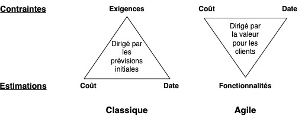
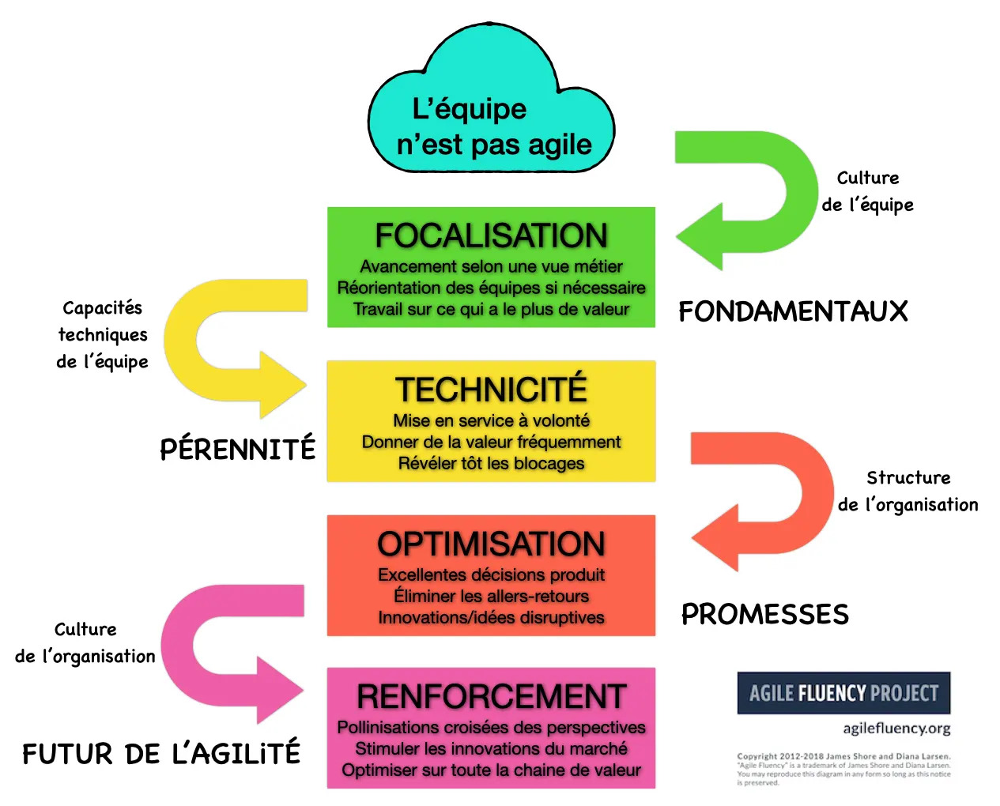

# SCRUM

> SCRUM - un outil convival pour une agilité radicale (6e edition) - Claude AUBRY - ISBN: 978-2100828296

## Sommaire

Intro

1. Scrum, un outil de l’agilité
    1.1. Scrum est un outil
        1.1.1. Un outil léger
        1.1.2. Un outil d’équipe
        1.1.3. Un nom dont le nom vient d’un jeu
        1.1.4. Un outil avec un mode d’emploi et une intention
    1.2. Scrum est agile
        1.2.1. Le Manifeste agile
        1.2.2. Les pratiques agiles
        1.2.3. Les méthodes agiles
        1.2.4. Scrum, la marque de l’agilité
    1.3. Scrum est adapté au travail de la connaissance
        1.3.1. Besoins évolutifs
        1.3.2. Problème complexe
        1.3.3. Intangible
        1.3.4. Solution nouvelle
        1.3.5. Décisions différées
        1.3.6. Capacité de changer radicalement
    1.4. De quel Scrum parlons-nous ?
        1.4.1. Un Scrum loyal vis à vis de la référence
        1.4.2. Un Scrum indépendant
        1.4.3. un Scrum en français
        1.4.4. Un Scrum élargi
        1.4.5. Faire de Scrum un outil convivial
// Première Partie - L’écosystème
2. L’équipe Scrum
    2.1. L’équipe redéfinie
        2.1.1. Une équipe c’est plus qu’un groupe
        2.1.2. L’équipe Scrum a une finalité
        2.1.3. L’équipe Scrum s’adapte à la situation
        2.1.4. Scrum est un outil de focalisation pour l’équipe
    2.2. Caractéristiques de l’équipe
        2.2.1. Taille raisonnable
        2.2.2. Auto-organisation
        2.2.3. Pluridisciplinarité
        2.2.4. Identité
        2.2.5. Stabilité
    2.3. Activités d’une équipe
        2.3.1. Coopérer
        2.3.2. Donner
        2.3.3. Réfléchir et améliorer
    2.4. L’espace de travail
        2.4.1. Les zones d’échanges
        2.4.2. Co-localisation physique
        2.4.3. Télétravail total
        2.4.4. Télétravail hybride
3. Le rôle de coéquipier
    3.1. Un Scrumeur ?
        3.1.1. Un membre d’équipe qui coopère
        3.1.2. Un joueur dans le collectif
    3.2. Activités
        3.2.1. Une journée typique de coéquipier
        3.2.2. Rythme soutenable : temps forts, temps faibles
    3.3. Attitudes
        3.3.1. Désir d’obtenir un résultat
        3.3.2. Goût des autres
        3.3.3. Envie d’apprendre le domaine métier
        3.3.4. Envie d’apprendre de nouvelles pratiques
    3.4. Compétences
        3.4.1. Scrum
        3.4.2. Techniques d’ingénierie
    3.5. Capacités
        3.5.1. Expliquer les techniques et outils utilisés
        3.5.2. Se focaliser pour finir un travail
        3.5.3. Travailler en groupe
    3.6. Exigences
        3.6.1. Rester dans l’équipe suffisamment de temps
        3.6.2. Suivre les règles
        3.6.3. Agir en accord avec son idéal
4. Le rôle de Product Owner
    4.1. Product quoi ?
    4.2. Activités
        4.2.1. Une journée de Product Owner
        4.2.2. Des activités qui portent sur le quoi
    4.3. Attitudes
        4.3.1. Envie de changer le monde
        4.3.2. Ouvert au feedback des utilisateurs
        4.3.3. À l’écoute des idées de ses coéquipiers
    4.4. Compétences
        4.4.1. Le domaine métier
        4.4.2. Scrum et l’agilité
    4.5. Capacités
        4.5.1. Percevoir la valeur
        4.5.2. Prendre les décisions concernant le résultat
        4.5.3. Détailler au bon moment
        4.5.4. Garder le cap
    4.6. Exigences
        4.6.1. Donner de son temps à l’équipe
        4.6.2. Pratiquer l’art de la conversation
        4.6.3. Dire non aux demandes en violation avec la mission de l’équipe
        4.6.4. Défendre l’équipe auprès des parties prenantes
5. Le rôle de Scrum Master
    5.1. Un maître ?
        5.1.1. Etymologie
        5.1.2. Analogies
        5.1.3. Entraineur joueur facilitateur
    5.2. Activités
        5.2.1. Une journée typique
        5.2.2. Trois rythmes
    5.3. Attitudes
        5.3.1. Curiosité pour les idées qui émanent de l’agilité
        5.3.2. Altruisme, au service de l’équipe
        5.3.3. Inclination pour l’entraide
        5.3.4. Ténacité
        5.3.5. Sensibilité aux émotions des coéquipiers
    5.4. Compétences
        5.4.1. Scrum et l’agilité
        5.4.2. Animation de groupe
        5.4.3. Le fonctionnel et la technique
    5.5. Capacités
        5.5.1. Favoriser la coopération
        5.5.2. Guider vers l’objectif
        5.5.3. Protéger l’équipe
        5.5.4. Critiquer de manière constructive
    5.6. Exigences
        5.6.1. Éliminer rapidement les obstacles
        5.6.2. Faire respecter les règles communes
        5.6.3. Se demander s’il est vraiment utile
6. Le rôle de partie prenante
    6.1. Qui est partie prenante ? Des contextes variés
        6.1.1. Développement interne
        6.1.2. Sous-traitance contractuelle
        6.1.3. B2B
        6.1.4. B2C
        6.1.5. Plateforme
    6.2. Activités dans le cadre de Scrum
        6.2.1. Prendre part
        6.2.2. Donner de l’expertise
        6.2.3. Donner les moyens
        6.2.4. Donner du feedback
    6.3. Attitudes
        6.3.1. Envie de donner
        6.3.2. Disposition pour le lâcher prise
        6.3.3. Mise en confiance
    6.4. Compétence
        6.4.1. Fondamentaux de l’agilité
    6.5. Capacités
        6.5.1. Transmettre son expertise
        6.5.2. Donner un bon feedback
        6.5.3. Déléguer au Product Owner
    6.6. Exigences
        6.6.1. Répondre rapidement
        6.6.2. Laisser les personnes à plein-temps
        6.6.3. Limiter les demandes urgentes
// Deuxième Partie - Les boucles
7. Le sprint
    7.1. Sprint, la boucle de Scrum
        7.1.1. Boucle à rythme régulier
        7.1.2. Sprint, un nom mal choisi
        7.1.3. Activités d’un sprint
    7.2. Bloc de temps
        7.2.1. Temps contraint
        7.2.2. Durée du sprint
    7.3. Objectif du sprint
        7.3.1. Un objectif de sprint pour s’engager
        7.3.2. L’objectif du sprint conditionne le contenu
    7.4. Plan de sprint
8. Le backlog
    8.1. Baque quoi ?
        8.1.1. N’y aurait-il pas un mot en français pour backlog ?
        8.1.2. Backlog d’équipe pas de produit
    8.2. L’outil essentiel de l’écosystème
        8.2.1. Public
        8.2.2. Réduit
        8.2.3. Ordonné
        8.2.4. Unique
        8.2.5. Vivant
        8.2.6. Émergent
    8.3. La story, une belle histoire
        8.3.1. Une story se raconte
        8.3.2. Une story est réalisée dans un sprint
    8.4. Structure du backlog
        8.4.1. Vie de la story
        8.4.2. Bac à sable pour les idées
        8.4.3. Entonnoir pour les stories à affiner
        8.4.4. Liste de départ des stories prêtes
    8.5. Tout est story
        8.5.1. Story à valeur utilisateur directe
        8.5.2. Story pour apprendre
        8.5.3. Story d’investissement
9. Le résultat du sprint
    9.1. C’est quoi le résultat ?
        9.1.1. Pourquoi ne pas dire incrément ?
        9.1.2. Pourquoi ne pas dire produit ?
        9.1.3. Le résultat n’est pas mis en service
    9.2. Le résultat est Fini
        9.2.1. Signification de fini
        9.2.2. Fini pour une story
        9.2.3. Fini pour le résultat du sprint
    9.3. Le résultat est Utile
        9.3.1. Utile pour réduire les risques
        9.3.2. Utile pour une mise en service ultérieure
        9.3.3. Utile pour prévoir
    9.4. Le résultat est Nécessaire
10. Les autres boucles
    10.1. La mise en service
        10.1.1. Le résultat de la mise en service
        10.1.2. Le feedback de la mise en service
        10.1.3. Valeur et revenu
        10.1.4. Qui décide de la mise en service ?
        10.1.5. À quel rythme mettre en service
    10.2. La fonctionnalité de valeur
        10.2.1. Deux points de vue sur le backlog
        10.2.2. La fonctionnalité
        10.2.3. Vie de la fonctionnalité
        10.2.4. Fini pour une fonctionnalité
    10.3. Le rythme des saisons
        10.3.1. Durée des saisons
        10.3.2. L’interlude de fin de saison
//Troisième Partie - Le prélude
11. Naissance de l’équipe
    11.1. Ouverture du prélude
        11.1.1. Situation de départ
        11.1.2. Durée du prélude
        11.1.3. Participants
        11.1.4. Qui anime ?
        11.1.5. Où se déroule le prélude ?
    11.2. Une équipe conviviale
        11.2.1. Entrainement des coéquipiers à la coopération
        11.2.2. Choix des rôles de Scrum Master et Product Owner ?
        11.2.3. Partage des idéaux des coéquipiers
        11.2.4. Examen de la capacité de l’équipe à vivre ensemble
    11.3. Une équipe alignée avec les parties prenantes
        11.3.1. Montée en compétence des parties prenantes dans Scrum
        11.3.2. Identification des expertises
        11.3.3. Vision du sponsor
        11.3.4. Mission de l’équipe
        11.3.5. Rappel des exigences pour les parties prenantes
        11.3.6. Accord sur les principes fondamentaux
12. Création du backlog
    12.1. Une création collective
        12.1.1. de quoi partir ?
        12.1.2. avec qui et où ?
        12.1.3. quand élaborer le backlog initial ?
    12.2. Alignement stratégique
        12.2.1. Objectifs et impacts clés
        12.2.2. Carte de POLICE
    12.3. Identifier les objectifs et impacts clés
        12.3.1. Définir les objectifs de saison
        12.3.2. Définir les impacts clés
    12.4. Premier backlog
        12.4.1. Lister les fonctionnalités
        12.4.2. story mapping
        12.4.3. Créer les stories
        12.4.4. Alimenter le backlog
13. Capacité de l’équipe à donner un résultat
    13.1. Logistique opérationnelle
        13.1.1. Ritualisation contextuelle
        13.1.2. Espace de travail
        13.1.3. Outils
        13.1.4. Règles du jeu
    13.2. Backlog prêt pour le sprint
        13.2.1. Premier affinage
        13.2.2. Prêt pour une story
        13.2.3. Prêt pour une fonctionnalité
        13.2.4. Objectif du premier sprint
    13.3. Test hello première boucle
    13.4. Première définition de fini
        13.4.1. Qui définit fini ?
        13.4.2. Exigences non fonctionnelles
        13.4.3. Comment définir fini ?
    13.5. Clôture du prélude
        13.5.1. Communication des résultats
        13.5.2. Rétrospective du prélude
        13.5.3. Célébration
// Quatrième Partie - Les rites
14. La planification du sprint
    14.1. Plus que de la planification, de la coopération
        14.1.1. Pourquoi planifier le sprint ?
        14.1.2. Avec quoi ? C’est la story qui sprinte
        14.1.3. Avec qui ? C’est l’équipe qui planifie
        14.1.4. Quand ? C’est le premier rite du sprint
        14.1.5. Où ? Selon le type de localisation
    14.2. Résultats de la planification de sprint
        14.2.1. L’équipe a un objectif
        14.2.2. L’équipe a un plan
    14.3. Comment planifier le sprint ?
        14.3.1. Se mettre dans le contexte du sprint
        14.3.2. S’assurer des stories prêtes
        14.3.3. Mettre en place le fourmillement
        14.3.4. Définir le taf
        14.3.5. S’engager
        14.3.6. Lancer le sprint
15. La mêlée quotidienne
    15.1. Mêlée comme au rugby ?
    15.2. Aléas pendant le sprint
        15.2.1. Obstacle
        15.2.2. Perturbation exogène
        15.2.3. Changement venant de l’équipe
        15.2.4. Terminaison des travaux
    15.3. Un rite quotidien
        15.3.1. Quand ? Tous les jours
        15.3.2. Pourquoi ? Pour avoir une boucle de feedback rapide
        15.3.3. Avec qui ? la mêlée appartient à l’équipe
        15.3.4. Où ? devant le tableau
    15.4. Résultats de la mêlée
        15.4.1. Une bonne ambiance
        15.4.2. En chemin vers l’objectif
        15.4.3. Des obstacles remontés
    15.5. Comment faire une mêlée
        15.5.1. Se réunir
        15.5.2. Présenter ce qu’on a donné
        15.5.3. Prévoir la coopération
        15.5.4. Identifier les obstacles
        15.5.5. S’améliorer pour atteindre l’objectif
    15.6. De la mêlée au maul
        15.6.1. La story se raconte
        15.6.2. Se répartir sur les stories
        15.6.3. Risques et bénéfices
16. L’affinage du backlog
    16.1. Comme un fromage
    16.2. L’affinage, ritualisé
        16.2.1. Pourquoi ? pour réussir les prochains sprints
        16.2.2. Avec qui ? Le PO et ses coéquipiers
        16.2.3. Quand ? Ritualiser les séances d’affinage
        16.2.4. Avec quoi ? Un backlog structuré
    16.3. Résultats de l’affinage
        16.3.1. Un backlog prêt
        16.3.2. Un écosystème en confiance
    16.4. Comment affiner ?
        16.4.1. Alimenter en stories prêtes
        16.4.2. Décomposer
        16.4.3. Approvisionner en nouvelles stories
        16.4.4. Purger
        16.4.5. Trier
        16.4.6. Estimer
        16.4.7. Réordonner
    16.5. Affiner les fonctionnalités
        16.5.1. Avec qui ?
        16.5.2. Comment ?
17. La revue de sprint
    17.1. Plus qu’une démo, du don
        17.1.1. Pourquoi ? Une invitation au feedback
        17.1.2. Quand ? En fin de sprint
        17.1.3. Avec qui ? Tous les gens de l’écosystème
        17.1.4. Où a lieu la revue ?
        17.1.5. Avec quoi ? Le résultat du sprint
    17.2. Résultats
        17.2.1. Du feedback
        17.2.2. Un écosystème plus en confiance
        17.2.3. Une visibilité sur l’avancement
    17.3. Comment faire une revue
        17.3.1. Préparer la revue
        17.3.2. Statuer sur l’objectif du sprint
        17.3.3. Effectuer la démo
        17.3.4. Collecter le feedback
        17.3.5. Évaluer l’impact obtenu
        17.3.6. Décider de l’avenir du produit
    17.4. Revue en trois parties
18. La rétrospective
    18.1. Un rite pour s’améliorer
        18.1.1. Pourquoi ? La boucle d’amélioration
        18.1.2. Quand ? Un moment de réflexion collective
        18.1.3. Qui ? C’est l’équipe qui refait le match
        18.1.4. Où se passe la rétrospective ?
    18.2. Résultats
        18.2.1. Equipe plus soudée
        18.2.2. Un objectif d’amélioration pour le prochain sprint
    18.3. Comment faire une rétrospective
        18.3.1. Créer un environnement propice à l’expression
        18.3.2. Collecter les informations sur le sprint passé
        18.3.3. Identifier des idées d’amélioration
        18.3.4. Sélectionner l’amélioration pour le prochain sprint
        18.3.5. Adapter Scrum pour le prochain sprint
    18.4. Exemples de rétrospectives
        18.4.1. Etoile de mer
        18.4.2. Rétrochataigne
        18.4.3. Bateau rapide
// Cinquième Partie - La coopération
19. Coopérer pour donner un résultat de qualité
    19.1. Importance des capacités des coéquipiers
    19.2. Pratiques autour du code
        19.2.1. Intégration continue
        19.2.2. Développement piloté par les tests
        19.2.3. Programmation en binôme
    19.3. Pratiques de conception
        19.3.1. Architecture évolutive
        19.3.2. Conception émergente
    19.4. Pratiques de test
        19.4.1. Test d’acceptation
        19.4.2. Accepter la story
    19.5. Maintenance
        19.5.1. Il n’y a pas de phase de maintenance
        19.5.2. Gestion des bugs
    19.6. Mob programming, la quintessence de la coopération
        19.6.1. Qu’est-ce que le mob programming ?
        19.6.2. Les rôles
        19.6.3. La passe
20. Coopérer pour prévoir
    20.1. Pourquoi planifier plus loin que le sprint ?
        20.1.1. Petit rappel sur la signification des échéances
        20.1.2. Prévoir pour préparer la mise en service du produit
        20.1.3. Prévoir pour décider
    20.2. Les fondamentaux de la planification agile
        20.2.1. Durée fixée, périmètre ajusté
        20.2.2. Vélocité et capacité
        20.2.3. Backlog et planification
        20.2.4. Quand planifier ?
        20.2.5. Avec qui planifier ?
    20.3. Comment planifier la saison
        20.3.1. Identifier la quantité de travail pour la saison
        20.3.2. Mesurer la vélocité et déduire la capacité
        20.3.3. Projeter sur le backlog
        20.3.4. Prendre en compte les incertitudes
    20.4. Engagement sur l’objectif de saison
        20.4.1. Sur un contenu ?
        20.4.2. Sur un objectif ?
        20.4.3. Engagement contractuel
    20.5. Résultats de la planification de saison
        20.5.1. Plus de transparence
        20.5.2. Un plan de saison actualisé
        20.5.3. Les réponses aux questions essentielles
    20.6. Prévoir sans estimer, la quintessence de la planification
21. Coopérer pour fluidifier le travail
    21.1. Pourquoi fluidifier ?
        21.1.1. Problèmes rencontrés avec Scrum dans certaines situations
        21.1.2. Brève introduction à Kanban
        21.1.3. Limites Kanban
    21.2. Limites les travaux du sprint
        21.2.1. Limite sur le nombre de tâches en cours
        21.2.2. Visualiser et limiter les urgences
    21.3. Limiter les stories
        21.3.1. Limite dans le sprint
        21.3.2. Limite dans le backlog
    21.4. Limiter les fonctionnalités
        21.4.1. Limite sur les colonnes
    21.5. Mesures et indicateurs
    21.6. Arrêter Scrum pour Kanban ?
        21.6.1. risques dans l’application de Kanban sur Scrum
        21.6.2. mauvaises raisons d’arrêter Scrum pour Kanban
        21.6.3. bonnes raisons d’arrêter Scrum pour Kanban
    21.7. Limiter à 1, la quintessence de la fluidité
22. Coopérer à plusieurs équipes
    22.1. Approche fractale et minimale
        22.1.1. Commencer à petite échelle
        22.1.2. Scrum de scrums
        22.1.3. Échelle verticale
    22.2. Plusieurs équipes
        22.2.1. L’écosystème avec plusieurs équipes
        22.2.2. Equipes fonctionnalités
        22.2.3. Le rôle de Product Owner
        22.2.4. La coopération entre les équipes
    22.3. Cycle de vie produit
        22.3.1. Synchronisation des équipes
        22.3.2. Saisons à date fixée
        22.3.3. Prélude
    22.4. Backlog et affinage à plusieurs équipes
        22.4.1. Kanban des fonctionnalités partagé
        22.4.2. Backlog de travail adapté
        22.4.3. Affinage à grande échelle
        22.4.4. Définitions de prêt et de fini à l’échelle
    22.5. Les rites du sprint à l’échelle
        22.5.1. Planification de sprint
        22.5.2. Mêlée
        22.5.3. Revue
        22.5.4. Rétrospective
        22.5.5. Résumé
    22.6. Antipatterns d’agilité à l’échelle
        22.6.1. La mode du scaling agile
        22.6.2. Les néocons
        22.6.3. Les accros aux plans
        22.6.4. Cargo cult Spotify
    22.7. FAST, la quintessence de la coopération à plusieurs équipes
23. Coopérer pour améliorer les capacités de l’équipe
    23.1. Stratégie d’amélioration
        23.1.1. Changement de paradigme
        23.1.2. S’orienter avec Agile Fluency
        23.1.3. Kata d’amélioration
    23.2. Comment améliorer les capacités ?
        23.2.1. Où voulons-nous aller ? L’objectif de l’agilité
        23.2.2. Où en sommes-nous de la maitrise de l’agilité ?
        23.2.3. Quel est notre objectif agilité de la saison ?
        23.2.4. Quelles capacités améliorer et acquérir ?
        23.2.5. Comment acquérir les capacités souhaitées ?
    23.3. Scrum, un outil convivial pour une agilité radicale

## Notes

Les fondations sont connues de beaucoup (et sinon vous les découvrirez plus loin dans le livre). L'auto-organisation de l'équipe, son autonomie (les prises de décision relatives à l'équipe sont prises par l'équipe, incluant naturellement le « Product Owner» et le « Scrum Master»). La capacité à découper en petits morceaux autonomes, qui font sens par eux-mêmes de façon à pouvoir les valider, observer leur impact, et apprendre ou engranger régulièrement de la valeur. Prioriser la réalisation de ces éléments par la valeur dont on estime qu'ils sont porteurs. S'interroger régulièrement sur comment s'améliorer. En voilà des fondations.

Ce que vous devriez rechercher dans le livre de Claude, notamment dans cette édition où je trouve que cela s'est étoffé, c'est cette glue philosophique, cette cohérence culturelle. Ce que j'exprimais dans la précédente préface c'est que si vous le viviez, vous le sauriez instantanément, car cela remue, cela demande un lâcher-prise.

J'ai constaté, comme Pablo le pointe dans sa préface, que Scrum était encore et toujours déformé, dévoyé, détourné ou carrément déshabillé;

Le rythme est donné par une série de boucles de feedback, appelées sprints.
Toutes les choses à réaliser sont ordonnées dans le backlog. L'équipe travaille sur la partie du backlog la plus prioritaire. Ce flux de travail est entrecoupé par la cadence régulière des rites du sprint:

- au début du sprint, la planification consiste à se mettre d'accord sur un objectif, et à préparer le travail pour y arriver;
- chaque jour, la mêlée est un point de synchronisation, en équipe, pour converger vers l'atteinte de l'objectif;
- à la fin du sprint, lors de la revue, l'équipe présente le résultat qu'elle a obtenu, afin de solliciter du feedback qui va alimenter le backlog ;

Si votre organisation est clairement dans une culture du contrôle et que vous n'êtes pas en mesure de promouvoir le changement radical nécessaire, Scrum n'est pas pour vous tout de suite. Il vaut mieux attendre, ou - mieux - essayer ce qui est décrit dans la partie Prélude.
De même, si vous travaillez continuellement dans l'urgence et que vous n'avez pas la capacité de réduire les perturbations, vous n'arriverez pas à focaliser l'équipe sur un sprint sans qu'elle soit perturbée. Dans ce contexte d'urgence permanente, l'usage de Scrum n'est pas le plus recommandé. Kanban est probablement plus adapté, même si, comme nous le verrons plus loin, il est aussi possible d'utiliser Scrum avec Kanban.

Je ne compte plus les personnes qui m'ont sollicité pour obtenir leur certification Scrum. Quand l'objectif premier n'est pas d'être bien formé mais d'être certifié, on est entré dans un système d'évaluation perverti.

Ce système est entretenu par les organismes de formation qui délivrent eux mêmes leur propre certification, ce qui va à l'encontre de l'évaluation indépendante qui devrait en régir l'obtention.

Après la Scrum Alliance et sa certification CM, Ken Schwaber a fondé Scrum.org qui a repris ce principe pyramidal en remplaçant le C de certifié par le P de professionnel, et en multipliant les offres pour chaque rôle et différents contextes. Alléchés par l'appât du gain, d'autres ont essayé de trouver leur place dans ce marché de la formation certifiante.

La nature radicale de Scrum - en particulier l'auto-organisation peut être diluée dans l'application mécanique d'éléments de méthode.

Considérer Scrum comme une technique neutre d'optimisation de travail en équipe n'est pas à la hauteur des enjeux actuels.

Le principal différenciateur de Scrum et de l'agilité, c'est l'importance accordée aux gens, le côté humain. En effet, le génie logiciel, le cycle en V, UML ne s'en préoccupent pas autant, et la gestion de projet et le management ont parfois tendance à ne considérer les personnes que comme des resources à gérer.

Cependant, la place des process est toujours importante, en particulier dans les grandes organisations, et les outils, souvent imposés aux équipes, contraignent les interactions plutôt qu'elles ne les favorisent. La réponse - radicale - donnée par Scrum, c'est la notion d'équipe auto-organisée.

L'équipe Scrum constitue un système complex de personnes poursuivant un objectif commun. Pour mettre en oeuvre Scrum, l'équipe ne s'isole pas à l'intérieur de sa membrane. Autour d'elle, il y a les parties prenantes, toutes celles et ceux qui sont intéressés par les résultats qu'elle va leur donner. Pour que l'équipe parvienne à s'auto-organiser, il convient que ses membres - les coéquipiers - soient en relation, non seulement entre eux, mais aussi avec les parties prenantes. Tous font partie du même écosystème.

Deux caractéristiques spéciales bornent l'auto-organisation des coéquipiers Scrum :

- un d'entre eux est chargé de la catalyser, c'est le Scrum Master (SM);
- un autre a un pouvoir de décision sur les aspects liés au produit (au quoi ?), c'est le Product Owner (PO).

Comme dans la pyramide de Dilts, ces caractéristiques invitent à progresser vers un alignement harmonieux : pour bien tenir un rôle, il est préférable d'avoir d'abord la bonne attitude, puis de posséder les bonnes compétences, etc. C'est aussi une aide pour définir la composition d'une nouvelle équipe et, du point de vue d'un coéquipier, choisir le rôle qu'il va y jouer.

Comme au rugby, une équipe agile c'est bien plus que des gens que l'on met ensemble à un moment donné. C'est aussi la some de toutes les interactions entre les coéquipiers, liés pour atteindre un objectif partagé

[une équipe] est un petit nombre de personnes avec des compétences complémentaires qui sont engagées sur une mission commune avec des objectifs de performance et avec une approche pour laquelle elles se tiennent elles-mêmes mutuellement imputables.

[les joueurs se retrouvent] dans des situations de jeu où ils devraient pouvoir développer des compétences autres que celles de leur poste.
L'investissement de chaque joueur dans ces tâches qui ne relèvent pas du poste, se doit de répondre au contexte situationnel

Pour montrer les traits essentiels d'une équipe, j'utilise l'acronyme TAPIS : Taille raisonnable, Auto-organisation, Pluridisciplinarité, Identité, Stabilité

- Taille raisonnable / auto-organisation

La question de la taille idéale d'un groupe n'est pas nouvelle. Des recherches
évaluent l'optimum à sept. Selon le Guide Scrum, une équipe ne devrait pas dépasser dix membres.

distinguer le quoi (quel travail) et le comment (la façon dont l'équipe s'organise):
- sur le quoi, s'il est souhaitable que les coéquipiers participent au débat, le Product Owner possède le pouvoir de décider;
- à propos du comment, l'équipe a toute latitude. Il n'y a pas de chef qui définit et assigne les tâches, c'est l'équipe qui décide comment décomposer le travail et l'accomplir. Il n'y a pas non plus de rôle spécialisé (architecte, développeur web, tester, etc.). Chacun se détermine et le Scrum Master facilite les prises de décision collectives.

- Pluridisciplinarité

Pour y arriver, il est nécessaire qu'elle dispose des capacités sur toute la chaîne de valeur, de la demande des utilisateurs jusqu'à la mise en service. C'est ce qu'on appelle la pluridisciplinarité.

Une équipe pluridisciplinaire c'est l'opposé des équipes constituées par spécialité:
imaginons une équipe de développement et une autre équipe chargée de la vérification de la qualité et du test fonctionnel; quand un élément est développé par les uns, il n'est fini qu'après avoir été vérifié et testé par les autres. Cette situation engendre des temps d'attente et des dépendances qui ne sont pas compatibles avec l'agilité souhaitée.

L'idée est ainsi d'acquérir continuellement de nouvelles compétences par le partage.

La pluridisciplinarité vise à réduire les risques liés aux dépendances, mais pas à éliminer toutes les interactions entre l'équipe et son environnement.

Ce moteur [qui motive l’equipe] c'est l'envie et le plaisir de travailler ensemble, ce sentiment d'appartenance qui forme une identité commune.

- Identité

L’identité de l’équipe se bâtit lors de la constitution de l'équipe (décrite dans la partie Prélude). Elle se conforte par des réussites : les rites de fin de sprint sont l'occasion de les partager avec les parties prenantes, puis de les célébrer ensemble.

- Stabilité

Pour devenir et rester efficace, la composition d'une équipe Scrum ne doit pas changer, car conserver les mêmes coéquipiers permet de mieux travailler ensemble et surtout de mieux vivre ensemble.

Donner est une déclinaison bien plus puissante, qui ouvre vers les boucles de feedback. En effet, le cycle du don vient d'une triple obligation:

- donner - pour renforcer les liens sociaux;
- recevoir - pour ne pas offenser le donateur;
- rendre - pour montrer sa capacité à participer au système d'échange.

En résumé : L'équipe Scrum est constituée des personnes qui coopèrent pour donner un résultat à chaque sprint. Une bonne équipe est de taille raisonnable, auto-organisée, pluridisciplinaire et stable. Il est souhaitable qu'elle puisse aménager son space de travail, co-localisé ou distribué avec du télétravail.

il est toujours important, en particulier dans les métiers de la connaissance, de réfléchir individuellement et collectivement. Réfléchir et s'améliorer sont les deux mamelles de l'apprentissage continu.

Le trait de caractère souhaité est l'altruisme.
Envie d’apprendre le domaine métier

Même si l'équipe possède en son sein une personne censée bien connaître Scrum (le Scrum Master), il est souhaitable que tous les membres de l'équipe soient formés.

FORCE = Focalisation Ouverture d’esprit Respect Courage Engagement

En résumé : Les personnes de l'équipe, appelées des coéquipiers, ont une place centrale dans Scrum. Un coéquipier est désireux d'obtenir un résultat, enclin à l'entraide, avec l'envie d'apprendre. Il a les capacités d'expliquer les outils et techniques qu'il utilise, de se focaliser et de travailler en groupe. Il s'engage à suivre les règles de travail, tout en restant en accord avec son idéal.

4)

Les problèmes causés par une spécification détaillée faite au début de projet sont connus :

- il est impossible de spécifier à l'avance tout ce que sera le produit final ;
- c'est même contre-productif car cela pousse à développer des fonctionnalités qui ne seront finalement pas utilisées;
- la séparation en deux entités (une qui écrit la spécification, l'autre qui la réalise) entretient une défiance néfaste.

Ce qui a été décisif, c'est l'émergence du rôle de Product Owner, grâce à la diffusion de Scrum. C'est avec ce rôle de représentant des clients et utilisateurs que s'est développée cette collaboration tant souhaitée, pas qu'avec le client, mais aussi avec les utilisateurs.

Il est devenu évident que la place du Product Owner était dans l'équipe. Membre à part entière, son rôle particulier sur le résultat et sur les priorités lui donne la responsabilité du quoi, c'est-à-dire ce que va faire le produit.

Le Product Owner pousse l'équipe à maximiser la valeur du résultat donné aux parties prenantes.

Ce rite (daily) régulier installe la coopération entre les coéquipiers. Il permet d'écouter les préoccupations de chacun et surtout de déceler les points de synchronisation utiles à l'achèvement d'un travail.

L'affinage est une activité de coopération dans laquelle le rôle du Product Owner est primordial. Il lui aura fallu au préalable réfléchir au travail qu'il allait donner pour alimenter l'équipe.

Le Product Owner définit le contenu du produit. Pour cela, il identifie les fonctionnalités requises, collectées après des parties prenantes et mises dans une liste, appelée backlog.
Le PO s'occupe du backlog et passe une bonne partie de son temps à l'affiner, en anticipation sur les sprints suivants.

Une autre façon de comprendre le rôle nous est donnée par Ron Jeffries. Il considère que le Product Owner partage les problèmes avec l'équipe et laisse ses coéquipiers les résoudre. Dit autrement, il donne des problèmes et l'équipe lui rend des solutions.

Réceptacle du feedback, le backlog, outil principal du Product Owner, vit et évolue pendant toute la vie du produit. Cela constitue une différence fondamentale avec l'idée souvent ancrée dans la culture des organisations qu'il faut figer les spécifications au début.

Coequipiers font émerger de nouvelles idées qui peuvent améliorer le produit. Il est important que le PO s'y intéresse et fasse confiance à ses coéquipiers.

Ce qu'on appelle le métier (business), et que l'on retrouve en français dans l'expression « coeur de métier», qui se réfère à un domaine de connaissances spécifiques en relation avec les utilisateurs du produit.

Des compétences se situant dans ce qu'on appelle le design de solution sont utiles au Product Owner: UX design, design thinking, lean startup, impact mapping, story mapping. Nous en verrons quelques-uns de ces outils dans l'élaboration du backlog initial.
En cas de télétravail total, le Product Owner deva acquérir des compétences sur de nouveaux outils permettant de coopérer à distance.

Le Product Owner décide des priorités en s'efforçant de maximiser la valeur.

au début, il existe des risques techniques et, plus tard, de la dette technique. Un dialogue avec ses coéquipiers est nécessaire pour définir les priorités dans le backlog.

C'est pourquoi le rôle de Product Owner est incarné par une seule personne, pas par un comité.

Un Product Owner agit à la fois sur la stratégie et sur la tactique: il prend des décisions de niveau stratégique qui étaient anciennement du ressort du chef de projet ou des comités de pilotage, comme le choix de la date de livraison du produit ou d'une fonctionnalité majeure à développer en priorité; il prend aussi de nombreuses décisions de niveau tactique.

La notion de priorité entre les éléments du backlog va l'y aider: ce qui est le plus prioritaire doit être prêt en premier. Le Product Owner affine, au bon moment, le contenu du backlog.

Bien qu'ouvert au changement, il n'est pas une girouette.

La disponibilité pour le rôle de PO est une condition sine qua non.

Le Product Owner fait partie de l'équipe, il participe don à ses rites.
En plus de participer à ces rites, le Product Owner contribue au travail de l'équipe; il peut, dans une journée:

- affiner le backlog, ajuster les priorités;
- répondre aux questions sur le produit;
- définir les conditions d'acceptation;
- vérifier qu'un travail est bien terminé;

Sa présence physique avec l'équipe a un impact sur sa disponibilité: la situation idéale est un PO installé avec l'équipe, dans le même space de travail. Cependant, il suffit qu'il soit assez proche pour que les autres équipiers puissent aller le voir et lui demander des précisions, et dans l'autre sens, pour qu'il puisse les rencontrer facilement pendant le sprint.

Quand le PO n'est pas assez disponible, peut-on nommer un PO remplaçant dans l'équipe? Non, c'est une mauvaise idée (bien que pratiquée et connue sous le nom de PO Proxy). Le vrai PO risque de remettre en cause les décisions de son remplaçant.

Impact mapping, story mapping, innovation games ... sont des outils coopératifs qui permettent au Product Owner de développer cet aspect social.

Le PO est dans l'équipe, c'est un coéquipier:. Il est co-responsable et co-contributeur des succès et des échecs. Il la soutient devant les parties prenantes, même s'il aurait aimé avoir plus de valeur à la fin d'un sprint. En faisant la promotion du résultat de chaque sprint après des utilisateurs, il fournit à l'équipe une reconnaissance qui la motive.

En résumé : Le Product Owner pousse l'équipe à maximiser la valeur du résultat donné aux parties prenantes. Il a envie de changer le monde, il est ouvert au feedback des utilisateurs et à l'écoute des idées de ses coéquipiers. Il connaît bien le domaine et les techniques de définition de produit et possède les capacités de percevoir la valeur, prendre des décisions, détailler au bon moment et garder le cap. Suffisamment disponible, il pratique l'art de la conversation, sait dire non et défend l'équipe après des parties prenantes.

5) scrum master

Le terme Scrum Master ne comporte aucune dimension hiérarchique.

Le Scrum Master est quelqu'un qui maîtrise les concepts de Scrum et possède les capacités pour aider ses coéquipiers à les comprendre et à les appliquer!

Scrum Master entraine les coéquipiers à coopérer pour donner un résultat et à réfléchir pour améliorer leurs capacités.

l'objectif d'une équipe Scrum, c'est devenir auto-organisée; le SM y contribue largement, on peut donc dire qu'il facilite l'auto-organisation.

Son rôle vise en premier l'épanouissement de l'équipe plus que son efficacité, la réussite du vivre ensemble provoquant celle du résultat.
Pour le dire autrement, le Scrum Master n'est pas responsable de l'efficacité de l'équipe. Sur ce point je suis en désaccord avec le Guide Scrum version 2020.

Coopérer est l'activité essentielle du Scrum Master: avec Scrum, comme au rugby, la coopération est spontanée (machine à café) ou ritualisée (mêlée). Chercher à améliorer l'équipe est aussi une activité clé dans son rôle d'entraîneur.

Possible de mettre en place un tableau/kanban des obstacles.

Le Scrum Master coopère avec le Product Owner, en particulier pour l'approvisionnement en travaux, toujours pour que le flot de travail soit régulier.

Pour affiner ensemble, il faut évidemment coopérer. La présence d'un expert extérieur à l'équipe indique une dépendance sur un sujet; le Scrum Master cherche à en réduire le risque.

"Etre remplaçable mais pouvoir remplacer nimporte qui"

en tant que coéquipier lui-même, il lui arrive de coopérer pour aider à finir des travaux, s'il a les capacités pour le faire.

Réfléchir aux émotions perçues, c'est une activité du Scrum Master en vue d'améliorer la sécurité psychologique de l'équipe.

> outil pour mesurer la santé de coéquipiers <https://blog.teammood.com/2018/07/24/evaluating-your-teams-health-with-the-niko-niko-calendar.html>

Le SM a des activités:

- périodiques, avec les rites du sprint auxquelles il participe;
- sur événement, pour réagir à des faits imprévus qui freinent l'équipe;
- de fond, pour réfléchir à comment améliorer la façon de travailler de l'équipe à
plus long terme.

Le SM est :

- altruiste: il place en premier l'intérêt de l'équipe.
- tenace
- sensible aux émotions des coéquipiers

Le Scrum Master pousse l'équipe à mettre Scrum en application. Au début, c'est essentiellement lui qui organise et anime les rites du sprint. Il fait en sorte que ces moments collectifs soient conviviaux et atteignent leur objectif.
Pour cela, il lui faut connaître des pratiques de facilitation, afin d'être en capacité de choisir l'atelier le mieux adapté à la situation, puis de l'animer.

> Les métacartes Faire Ensemble constituent une boîte à outils sophistiquée pour l'animation de groupe:
<https://www.metacartes.cc/faire-ensemble/>.

Il utilise la conviction, sans imposer ses décisions: un Scrum Master ne dispose pas d'autorité hiérarchique sur les membres de l'équipe, son leadership merge naturellement.
Il lui arrive de jouer le rôle de médiateur en cas de conflit.

décision collective

Teletravail/Remote nécessite d'apprendre de nouveaux outils qui permettent le partage et les interactions en ligne.

On le suit parce qu'il a cette capacité d'augmenter les capacités des coéquipiers, ce qui leur fait espérer une vie meilleure ensemble.

Le SM est garant de la sécurité de l'équipe.

Éliminer rapidement les obstacles

La réactivité souhaitée demande une haute disponibilité.

- d'abord, il apprend Scrum à l'équipe;
- ensuite, il guide l'équipe dans l'application de Scrum;
- puis il aménage le cadre du vivre ensemble pour que les membres de l'équipe prennent plus d'initiatives;
- et enfin, il les entraîne à faire émerger l'intelligence collective.

À lui de se questioner régulièrement sur son utilité.

En résumé : Le Scrum Master entraîne les coéquipiers à coopérer et à développer leurs capacités, pour donner un résultat. Il est curieux pour l'agilité, altruiste, donateur, tenace et sensible aux émotions. Il est bien sûr compétent dans Scrum et l'agilité et sait animer un groupe. Il favorise la coopération, guide vers l'objectif et protège l'équipe. Il doit se rendre disponible, être cohérent avec les règles communes et se demander s'il est vraiment utile.

Partie prenante = plutôt une partie « entreprenante », voire une partie « donnante »,
L'équipe Scrum vise la pluridisciplinarité, c'est-à-dire qu'elle tend à intégrer toutes les compétences nécessaires pour développer totalement le produit fini.

Les parties prenantes sont invitées à un rite : la revue de sprint. Au cours de cette rencontre, elles sont sollicitées pour donner leur feedback.

En tant que partie prenante, l'expert assiste à la revue de sprint. De plus, il participe à d'autres rites du sprint, aux moments de sa collaboration active, comme l'affinage ou la planification.

Les managers étant des personnes intéressées par les résultats de l'équipe ils sont considérés comme des parties prenantes et on attend d'eux cette attitude de mise en confiance.
Faire confiance signifie l'abandon de la culture du contrôle.
C'est aussi limiter leurs demandes urgentes, qui créent des perturbations.

À cette organisation linéaire et séquentielle du travail, basée sur la conception et la planification a priori, Scrum oppose un système circulaire (les boucles !), basé sur la réactivité a posteriori, aux nouvelle informations.
La rupture s'opère sur deux éléments clés:

- l'orientation client : au lieu d'être le bénéficiaire passif au bout d'une chaîne de production, le client a un rôle actif, au coeur de l'approche par boucles de feedback;
- l'auto-organisation : plutôt que suivre les processus définis par d'autres, les coéquipiers s'auto-organisent pour fair le travail.

Le rythme soutenable est un principe de l'agilité. Une cadence raisonnable permet d'éviter des situations de sur-régime.

À l'autre extrême de l'approche séquentielle, il existe des développements qui sont menés en suivant «la méthode à l'arrache ». Le plus souvent, il n'y a pas d'activité de spécification ni de conception.

- la capacité de l'équipe à produire un résultat;
- l'implication des parties prenantes à donner du feedback ;
- la facilité à organiser des rites efficaces;

En cas d'hésitation, un principe - contre-intuitif - est de prendre la durée la plus courte, un moyen d'apprendre plus tôt.

L'objectif du sprint est la promesse du résultat espéré. Il sert à l'équipe, mais également aux parties prenantes, auxquelles il est communiquê.

L'engagement d'une équipe vise à assurer l'efficacité de son action.

En effet le plan de sprint est au centre de la pratique quotidienne de l'agilité. Il sert de support au rite de la mêlée quotidienne et permet de suivre l'avancement. Il montre le travail à faire, le travail en cours et le travail fini. C'est donc l'outil sur lequel va se bâtir l'auto-organisation de l'équipe. En particulier, il sert à déterminer qui fait quoi, et quand.

8)

Dans les projets traditionnels, la « spécification » se fait entièrement au début du projet et se concrétise dans un document qui décrit ce que va faire le produit, quelles sont les fonctions attendues et quel est le comportment souhaité. Ce document devient volumineux car on se dit qu'il faut tout écrire et tout détailler pour ne rien oublier afin que les développeurs sachent bien ce qu'ils ont à faire.
Plus tard, on s'aperçoit que le gros document ne leur a pas vraiment servi. Il n'a pas convenu non plus, encore un peu plus tard, à l'équipe chargée des tests fonctionnels.
C'est vrai qu'il n'est pas facile de rentrer dans les deux cents pages pour quelqu'un qui ne connaît pas bien le domaine.
Et si le besoin change, évolue, la mise à jour est fastidieuse et peu de personnes se replongent dedans. D'ailleurs les personnes qui ont rédigé les spécifications au début sont certainement sur d'autres sujets. Et bien sûr, elles ne sont plus à jour après quelques semaines de développement, voire dès leur rédaction.

Pas d'exigences dans un backlog.

Je ne dis pas backlog du produit, mais simplement backlog,

Une équipe possède un backlog dans lequel elle met tous ses travaux, même s'ils portent sur plusieurs produits ou projets.

Le backlog contribue à l'élégance et à la simplicité de l'outil Scrum.
C'est le coeur des échanges dans l'écosystème.

Le backlog a quelques caractéristiques remarquables qui forment l'acronyme PROUVÉ : Public Réduit Ordonné Unique Vivant Emergent

Le backlog est un outil partagé. Il convient aussi qu'il soit compréhensible et c'est la responsabilité du Product Owner de s'en assurer.

Quand on débute avec Scrum, on a tendance à mettre du stock dans le backlog qui devient monolithique. C'est peu pratique. C'est souvent trop gros. Et cela se partage mal.

Dans un backlog, les éléments sont rangés selon l'ordre envisagé pour leur réalisation.

C'est le seul canal d'alimentation de l'équipe.

Le backlog est vivant parce qu'un produit évolue toujours, sinon il est mort.

Le mythe du document exhaustif qui décrit tout dès le début a beau persister, le constat a toujours été le même : il est impossible de tout connaître dès le début d'un projet. En réfléchissant longtemps et en essayant d'imaginer les situations possibles, on peut bien sûr découvrir un bon nombre de fonctions significatives, mais il en existera toujours qui émergeront seulement au contact des utilisateurs finaux.

Au fil du temps, un élément du backlog a été nommé story; la notion provient d'Extreme Programming; elle est désormais largement utilisée avec Scrum.

C'est donc en racontant un usage avec le point de vue des utilisateurs qu'on va définir ce qu'il y a à faire. Cette notion s'appelait à l'origine user story, ce qui montre bien l'orientation utilisateur.
Cette orientation utilisateur se retrouve dans la description de la story qui montre quelle valeur elle procure (et pas les détails de réalisation), afin de faciliter son placement ordinal dans le backlog par le Product Owner.

Vie de la story :

- Le Product Owner et l'équipe l'affinent au cours de conversations, afin qu'elle devienne une story pouvant être réalisée en un sprint.
- L'équipe apporte sa confirmation qu'elle est prête.
- L'équipe réalise la story pendant un sprint, en tenant de nouvelles conversations avec le PO, pendant sa réalisation.
- Le Product Owner apporte sa confirmation qu'elle est finie.

Une story est réalisée en un sprint.

- Types de story
  - À valeur utilisateur directe
    - valeur créée
      - story fonctionnelle
      - documentation
    - valeur rétablie
      - correction de bug
    - valeur augmentée
      - story non fonctionnelle
  - Pour apprendre (sur une autre story)
    - côté fonctionnel
      - découverte
      - test A/B
    - côté technique
      - étude (spike)
  - D'investissement(valeur utilisateur indirecte)
    - pour le résultat
      - remboursement de dette technique (cleanup)
      - mise à niveau de composants
    - pour l’efficacité des coéquipiers
      - formation
      - outils

Technique de réduction de risque (appelée spike); diminuer le risque, c'est apprendre.

Décrire les stories d'investissement (technique) avec une orientation utilisateur est souhaitable pour montrer leur intérêt; cela demande parfois beaucoup d'efforts de la part de l'équipe.

L'identification de la dette technique, en vue de la limiter, va dans le sens du développement durable et c'est dans ce sens que cela doit être présenté au PO et aux parties prenantes.

Travaux techniques et remboursement de dette ne sont pas toujours visibles dans le backlog. L'équipe peut décider de les inclure dans une story, considérant que c'est sa responsabilité de faire ces investissements.

En résumé : Le backlog est le réservoir des choses à faire qui alimente les boucles et qui est lui-même alimenté par le feedback issu des résultats. Un backlog est public, de taille réduite, ordonné, unique, vivant et émergent. Pour faciliter son usage, il est utile de le structurer en se basant sur la hiérarchie (fonctionnalité, story) et la vie des éléments (prêt, fini) et sur leur apport de valeur (direct, indirect).

9)

Le résultat est un tout fini, utile et nécessaire (FUN) déployé par l'équipe sur un environnement où il pourra être montré à l'occasion d'un rite dédié, la revue.

La mise en service n'est pas synchronisée avec une fin de sprint.

La définition de fini a pour objectif de garantir la qualité du résultat. Cela commence par des stories finies.

La définition de fini pour une story est une liste de vérifications, élaborée et contrôlée par l'équipe.

Catégories de vérification pour la définition de fini :

- Fonctionnement : ca marche!
- Qualité externe : c'est utilisable
- Qualité interne : c'est maintenable

Pour l'équipe, apprendre, c'est réduire les risques et avancer malgré les incertitudes.

En résumé : Le résultat du sprint est le tout que l'équipe obtient à la fin d'un sprint lui permettant d'apprendre. La qualité du résultat est vérifiée avec la définition de fini. Le résultat du sprint est utile pour apprendre. Il est nécessaire pour obtenir le feedback, moteur des boucles.

C'est le Product Owner qui décide de la mise en service. Sa décision s'appuiera sur les avis des parties prenantes et ceux des coéquipiers qu'il aura sollicités.

La tendance est de raccourcir les boucles de mise en service. Du point de vue technique, c'est l'outillage DevOps qui permet d'être prêt,

- la story qui s'adresse à l'équipe;
- la fonctionnalité, pour communiquer avec les parties prenantes (bien entendu,
elle est aussi utile à l'équipe).

Kanban des fonctionnalités

Finir une story, c'est bien; finir une fonctionnalité, c'est mieux!

Pourquoi un interlude en fin de saison ? Pour faire un cycle de réflexion/amélioration à une cadence différente, qui portera sur des notions qui changent moins souvent que le sprint.

- une rétrospective plus poussée sur toute la saison passée;
- une évolution légère de l'effectif de l'équipe;
- une purge du backlog;
- une prévision sur la saison suivante.

le prélude comporte trois parties :

- naissance de l'équipe,
- création du backlog initial pour alimenter les boucles,
- capacité de l'équipe à obtenir un résultat à partir du backlog.

L'outil support pour le prélude est un canevas: le Canvas d'Alignement Radical pour l'Equipe (CARE). Un canevas, c'est pratique pour partager l'essentiel des éléments permettant de prendre un engagement collectif.

Les numéros des cases correspondent à l'ordre dans lequel on les remplit.

Situations possibles en début prelude :

- On a fait du Lean Startup, on décide de passer à Scrum pour exploiter les résultats du MVP.
- Il s'agit de lancer un nouveau projet, avec une nouvelle équipe, dans une organisation qui pratique déjà Scrum.
- L'équipe pratique déjà Scrum, mais elle a perdu son agilité ou sa composition a changé ou le produit sur lequel elle travaille est nouveau.
- ...

Exemple de planning de prélude :

| Lundi               | Mardi                        | Mercredi                           | Jeudi                                 | Vendredi                    |
|---------------------|------------------------------|------------------------------------|---------------------------------------|-----------------------------|
| Ouverture           | Formation parties prenantes  | POLICE : Objectifs et impacts cles | CARE 6 a 9: Logistique operationnelle | CARE 10: Definition de fini |
| CARE 1: coequipiers | CARE 3: Parties prenantes    | Story Mapping                      | Premier affinage                      | Retrospective               |
| CARE 2: ideaux      | CARE 4 et 5: Vision, mission |                                    | Hello Premiere Boucle                 | Cloture                     |
| Equipe conviviale   | Equipe alignee               | Backlog initial                    | Equipe capable d'obtenir un resultat  | Celebration                 |

Le prélude est conçu pour se dérouler en présentiel. La convivialité et l'alignement sont des moments de rencontre physique.

La rétro-confinement est un outil basé sur les travaux du philosophe et sociologue Bruno Latour <https://agileradical.org/outils/retroconf/>

Attitues souhaitées:

- Scrum Master
  - Curiosité pour les idées qui émanent de l'agilité
  - Altruiste, au service de l'équipe
  - Inclination pour l'entraide
  - Tenacité
  - Sensibilité aux émotions des coéquipiers
- Product Owner
  - Envie de changer le monde
  - Ouvert au feedback des utilisateurs
  - A l'écoute des idées de ses coéquipiers
- Coéquipier
  - Désir d'obtenir un résultat
  - Goût des autres
  - Envie d'apprendre le domaine métier
  - Envie d'apprendre de nouvelles pratiques

Trois outils (voir partie 1) facilitent cette prise de connaissance: le T shape au niveau individuel, la matrice de compétences au niveau collectif et le ACCES comme base de discussion.

Capacités souhaitées :

- Scrum Master
  - Favoriser la coopération
  - Guider vers l'objectif
  - Protéger l'équipe
  - Critiquer de manière cronstructive
- Product Owner
  - Percevoir la valeur
  - Prendre les décision concernant le résultat
  - Détailler au bon moment
  - Garder le cap

Un idéal peut porter sur le résultat (par exemple la fierté de participer à un service qui apporte du bien-être aux utilisateurs) ou sur le travail (comme la reconnaissance par un pair ou par un manager) ou sur la soif d'apprendre de nouvelles techniques (illustrée par le T shape).

- compétence demandée aux parties prenantes : les fondamentaux de l'agilité.
Cette compétence est indispensable pour jouer correctement le rôle de partie prenante : c'est le rempart contre l'ignorance, et l'orgueil à l'origine du faux agile.

La vision du sponsor exprime le futur désiré des utilisateurs du produit ou service. Elle sert de point focal pour faire émerger cette nouvelle image.

Le Product Owner reformule la vision à partir de la demande du sponsor.

- exigences pour les parties prenantes:
  - Répondre rapidement aux demandes.
  - Laisser les personnes à plein temps dans l'équipe.
  - Limiter les demandes urgentes.

Ces devoirs sont la contrepartie du don fait par l'équipe à chaque fin de sprint, c'est le moment de le rappeler.

ritualisation qui concerne les parties prenantes, c'est-à-dire:

- la durée envisage des sprints et des saisons,
- la date de début du premier sprint,
- le jour et l'heure prévus pour le rite Scrum aquel elles sont invitées, la revue.

12)

il est souhaitable que l'élaboration du backlog soit collective, au cours d'ateliers avec les coéquipiers et les parties prenantes ; leur présence permettra d'obtenir différents points de vue.

Definition : un impact est un changement dans le comportment d'une partie prenante.

POLICE est l'outil de Pilotage par Objectifs en Lien avec des Impacts Clés Externes, inspiré de l'impact mapping et de la méthode OKR.

L'impact mapping est un outil de planification stratégique qui se présente sous forme de carte heuristique (mindmap). La carte contient, pour un projet ou un produit : son objectif, au centre de la carte, les acteurs concernés ensuite, puis les impacts attendus, et enfin les fonctionnalités que l'on imagine pour obtenir ces impacts.
Cela donne une présentation du produit sous une forme synthétique et élégante.

L'introduction d'OKR dans l'agilité fait l'objet de contributions d'Allan Kelly(<https://www.allankelly.net/books/succeeding-with-okrs-in-agile/>) et de Laurent Morisseau(<https://risinggoal.com/fr/2021/10/06/modele-okr/>)

on parle des impacts, c'est-à-dire des changements de comportement, dans la vraie vie, pas dans un logiciel !

Un objectif de saison présente une description qualitative de ce que l'équipe veut atteindre en un trimestre pour cheminer vers sa mission.

L'identification des impacts peut être facilitée avec l'atelier : «les impacts rétrofuturistes », au cours duquel on demande aux participants de se placer dans le futur, un peu après la fin de la saison, en considérant que le produit est mis en service depuis quelque temps et que c'est un succès. Ils justifient pourquoi c'est un succès en revenant sur des faits concrets qui ont changé leur vie.

Une fonctionnalité est un service ou une fonction d'un produit dont l'énoncé est clair pour les parties prenantes ; une fonctionnalité contribue à un impact clé et se décompose en stories.

Il s'agit ensuite de les ordonner et de les trier avant de les décomposer pour alimenter le backlog de stories. L'outil dont nous allons nous servir pour cela est le story mapping.

Une story map permet de visualiser des scénarios d'usage et de préparer l'enchaînement des stories.

Un risque est un événement qui peut survenir et mettre en péril l'objectif de la saison.

La notion de risque, fonctionnel ou technique, est donc essentielle pour élaborer le backlog initial.

La première étape du story mapping consiste à créer la colonne vertébrale du produit ou service sur la première ligne. Les fonctionnalités sont organisées de façon chronologique, en vue de définir un enchaînement (une chaîne de valeur) logique selon l'usage du produit

Si l'équipe est nombreuse, j'encourage à du fourmillement pour paralléliser le découpage en stories

On demande aux membres de l'équipe d'indiquer les stories qui leur paraissent présenter des risques (techniques ou autres).

Ces stories de réduction de risque sont généralement à haute priorité. Si c'est le cas, on les place dans une ligne en haut de la carte.

En résumé : La création du backlog passe par un alignment stratégique sur la mission, en définissant les objectifs et impacts clés de la première saison. Le pilotage par objectifs permet d'obtenir une liste de fonctionnalités. L'outil story mapping facilite la décomposition en stories et leur priorisation en tenant compte des risques pour produire le backlog initial.

L'affinage mérite une réflexion particulière : pour une équipe qui démarre, il gagne à être ritualisé.

La case 8 présente les outils choisis de l'équipe. Il convient de procéder à l'installation de l'environnement de développement si ce n'est pas encore fait, et à la formation des membres de l'équipe s'il y a de nouveaux outils.
Cela pousse à s'intéresser aux problématiques DevOps et à faire participer les experts de ce domaine dès le prélude.

<https://www.metacartes.cc/numerique-ethique/>

les règles d'équipe:

- la participation aux rites;
- la façon dont les décisions sont prises (on rappellera que le Product Owner décide du quoi);
- la façon dont est traitée une urgence (et ce qu'est une urgence);
- la liste des données collectées en fin de sprint, à des fins de métriques.

Le PO est le seul qui a le pouvoir de decider si une story est prete. Pour prendre sa décision, il pourra s'appuyer sur une définition de prêt.
La définition de prêt consiste en une liste de recommandations.
La liste ne contient pas des contrôles qui s'appliqueraient à toutes les stories sans discernment. Il s'agit de recommandations qui demandent du jugement.

Quelles recommandations? Les équipes s'appuient parfois sur l'acronyme INVEST.

Pattern 6D

1. Désirable : est-ce que la story apporte quelque chose à quelqu'un?
2. Décomposée: est-ce qu'elle est suffisamment petite ?
3. Débattue: est-ce que nous avons eu une conversation à propos de cette story?
4. Démontrable: est-ce qu'on saura en faire une démonstration à la revue ?
5. Est-ce qu'elle possède une Définition de fini ? Pour qu'elle soit prête, c'est biende savoir ce qui permettra de dire qu'elle est finie.
6. «Dérisquée »: est-ce qu'il y a des risques sur la réalisation

TEST «HELLO PREMIÈRE BOUCLE»
Ce test, réalisé en équipe permet de vérifier l'intégration des briques logicielles, + l'ensemble de la chaîne de production, y compris l'intégration continue, le gestionnaire de sources et le déploiement.

Je conseille de lister d'abord toutes les vérifications sur des Post-it, puis de les associer, dans un deuxième temps, à l'un des niveaux (story, fonctionnalité, mise en service) pour une des trois catégories: fonctionnel, qualité interne, qualité externe.

Les réflexions devraient notamment porter sur le niveau où placer les exigences non fonctionnelles ou transverses (utilisabilité, fiabilité, performance, sécurité, etc.).

Retrospective de prélude : suivante.
L'objectif est de réfléchir ensemble à la façon dont ce prélude s'est déroulé dans le but d'améliorer le prochain prélude, car oui il est probable que l'équipe aura l'occasion d'en refaire.

Un rite Scrum est un exercice collectif pendant lequel les coéquipiers coopèrent pour avoir de la visibilité sur le résultat que l'équipe va donner et réfléchissent, à partir ce qui est rendu visible, pour l'améliorer.

Dans l'équipe, le suivi du travail n'est pas l'apanage d'un seul, mais l'affaire de tous: chacun rend visible aux autres le travail qu'il fait.

Les rites apportent de la confiance à l'équipe. On a toujours besoin de se donner un objectif et en déduire des travaux à faire (planification). On a toujours besoin de se synchroniser (mêlée). On a toujours besoin de réfléchir et améliorer le résultat (revue) et la façon de travailler (rétrospective). La ritualisation rend plus facile la tenue de ces activités.

Ces moments de rencontre ne sont pas des réunions au sens usuel. Il n'y a pas d'ordre du jour ni de compte-rendu. Ce sont des prétextes à développer l'intelligence collective.

Une story est prête si elle est suffisamment petite et bien comprise par l'équipe, qui se sent alors capable de la finir dans un sprint.

Le travail du sprint appartient à l'équipe, qui décide elle même comment elle veut s'organiser.

C'est souvent à cause des estimations que la planification dure trop longtemps. Elles ne devraient pas être faites pendant la planification, mais lors de l'affinage.

Il peut arriver que l'équipe décide d'avoir une durée de sprint différente. Cela a pu être anticipé dans le cas de vacances pendant le sprint (par exemple à Noël).

Le fourmillement (swarming) consiste en une division temporaire de l'équipe.
Le sous-groupe créé va s'agglutiner sur une story le temps de la finir.

Le steward d'une story est un coéquipier qui connaît bien l'histoire. Il s'y est intéressé dès l'affinage.

Les groupes se créent, par la grâce de l'auto-organisation, autour d'une story et décident eux-mêmes d'avoir un steward ou de s'en passer.

Une tâche est un travail contribuant à une story mais n'apportant pas de valeur par lui-même.

La définition de fini, avec sa liste de vérifications, aide à ne pas oublier des tâches.

Un bon principe est d'avoir une tâche finie le lendemain du jour où elle a été commencée. C'est un point qui se vérifie naturellement lors de la mêlée quotidienne.
Cela veut dire que non seulement l'effort pour réaliser la tâche est limité, mais que cet effort est condensé sur un jour au lieu d'être morcelé sur plusieurs jours. Cela donne la satisfaction de finir les choses, c'est important pour le moral.

L'équipe s'engage sur l'objectif du sprint !

Attention à ne pas définir un objectif comme un énoncé de plusieurs stories. Il vaut mieux éviter les «et», car cela revient souvent à avoir plusieurs engagements individuels.

L'objectif du sprint est public pour les parties prenantes. Il est d'ailleurs souhaitable de le préparer avec elles à la fin de la revue du sprint précédent. Cependant c'est l'équipe qui le finalise, en connaissant bien le travail à faire.

L'équipe s'engage à produire un résultat correspondant à l'objectif avec le niveau de qualité requis dans la définition de fini. Elle s'engage également à prévenir le Product Owner dès que l'objectif est remis en question, ou s'il peut être augmenté.

Si la planification prend trop de temps, est-ce que le Scrum Master peut affecter le travail aux personnes? Non, l'équipe ne serait pas engagée.

En résumé : La planification du sprint est le rite au tout début du sprint servant à déterminer l'objectif et à produire le plan de sprint. Pour la réussir, il convient de ne pas la voir uniquement comme une séance de planification, mais aussi comme un exercice collectif pendant lequel l'équipe apprend à s'auto-organiser et à partager la connaissance sur le produit et sur la solution pour le développer.

15)

Pendant le daily, les obstacles sont identifiés et les rendez-vous pris pour les éliminer; les points de synchronisation de la journée sont définis.

La mêlée s'appelle stand up meeting dans Extreme Programming, ce qui fait bien comprendre qu'on reste debout, pour rester focalisé.

L'équipe peut s'attendre à subir deux formes d'aléas:

1. ceux qui sont inhérents à l'exécution du sprint par l'équipe, appelés des obstacles;
2. ceux qui sont dus à des changements exogènes, car la bordure qui protège l'équipe pendant un sprint est perméable.

Rendre les obstacles visibles dans un tableau.

En principe, l'équipe n'est pas perturbée pendant le sprint. Le Scrum Master la protège des interférences extérieures, en l'occurrence des parties prenantes.

La transparence pousse à mettre le travail ajouté sur le tableau de sprint. Le prélèvement ponctuel d'une personne aura sa place dans la liste des obstacles.

Cette story sans contenu servira de place réservée pour les urgences à venir (c'est prévoir l'imprévu!)

Il arrive que des tâches soient découvertes pendant le sprint: en travaillant sur une story, on s'aperçoit qu'un travail important, ignoré jusque-là, devient nécessaire. C'est la manifestation de la notion d'émergence.

La décision de déclarer une story fine est - en principe - prise par le PO. Mais si l'accord sur les choses à vérifier s'est fait avec l'équipe, et que la confiance est là, il peut déléguer cette responsabilité.

- Fréquence: chaque jour du sprint.
- Durée: moins d'un quart d'heure.

trois questions simples, au sujet de ce qui a été fait, de ce qui va être fait et des obstacles rencontrés.

La mesure du temps passé sur une tâche n'est pas utile avec Scrum, pas plus que son estimation. Cela évite de faire du micro-management avec un suivi individuel. On ne mesure pas non plus le temps passé sur une story. (sauf si equipe junior)

Toute l'équipe participe à la mêlée. Une réserve possible concerne le Product Owner. Sa présence n'est pas obligatoire tous les jours. Le minimum est qu'il soit là au moins deux fois par semaine, et si possible tout le temps, c'est mieux.

Le daily n'est pas une réunion pour faire un compte rendu au Scrum Master (ni au PO ni à quiconque).

Pour éviter de tomber dans cette routine, le Scrum Master (ou un membre de l'équipe) propose des variations dans le déroulement des mêlées:

- la prise de parole se fait un coup de gauche à droite, un coup de droite à gauche, ou de façon aléatoire;
- la réponse aux trois questions se fait une fois à la suite pour chaque personne, une autre fois par trois tours avec une question à chaque fois.
- la personne qui vient de parler choisit la personne à qui elle passe la parole.

Pour tenir dans un délai aussi court, il est souhaitable de disposer d'une aide visuelle. Le tableau de sprint fournit cette assistance.

on démarre par la projection de l'objectif de sprint et l'objectif d'amélioration continue, puis on bascule sur la vue tableau où chacun voit et commente l'avancement,

La mêlée quotidienne permet de définir les moments de synchronisation au sein de l'équipe et avec les parties prenantes.

Le daily permet de développer la coopération dans l'équipe par une réponse collective et synchronisée aux aléas quotidiens.

Rappelons que l'objectif du sprint dont il est question contient deux parties : l'objectif de résultat défini lors de la planification du sprint; l'objectif d'amélioration (kaizen) identifié lors de la rétrospective

Il est de la responsabilité du Scrum Master de classer les obstacles par priorité et de faire en sorte qu'ils soient éliminés au plus vite.

L'équipe se réunit. Chacun s'exprime à tour de rôle en disant ce qu'il a fait, ce qu'il va faire et ce qui l'empêche d'avancer vers l'objectif du sprint. En fonction de ces informations, l'équipe s'adapte à la situation pour éliminer les obstacles et atteindre l'objectif du sprint.

Quand un obstacle est identifié en séance, il est possible qu'un des coéquipiers connaisse déjà un moyen de l'éliminer. Il le donne immédiatement.

Burnup/burndown : Ces indicateurs sont destinés uniquement à l'équipe. Ils peuvent sinon avoir des effets de bord, comme leur utilisation par des parties prenantes pour mettre la pression.

Maul = daily orienté story
Dans cette approche Maul, les trois questions ne sont pas pour chaque coéquipier, mais pour chaque story en course.

En résumé : La mêlée est le rite de partage quotidien entre les membres de l'équipe permettant d'organiser la journée et de vérifier l'alignement sur l'objectif du sprint. C'est une pratique renforçant l'auto-organisation qui a prouvé son efficacité et qui ne coûte pas cher à mettre en place. Il ne s'agit pas simplement de rester debout et de répondre aux trois questions. L'objectif est de mettre l'équipe en situation de réussir le sprint. Pour cela, les obstacles sont identifiés et les rendez-vous pris pour les éliminer; les points de synchronisation de la journée sont définis.

16)

L'affinage consiste à maintenir un backlog prêt, pour augmenter les chances de succès des futurs sprints.

Le Product Owner qui est le principal affineur coopère avec l'équipe : une grande partie de l'affinage a lieu lors de séances de travail en commun
Il est souhaitable que tous les coéquipiers participent à cette activité. Des parties prenantes sont invitées selon le besoin. Des experts fonctionnels sont invités quand leur domaine est abordé.

Il y a deux possibilités pour l'organisation des séances d'affinage: sur demande ou ritualisé,

- Le Scrum Master surveille le niveau des stories prêtes, et s'il constate qu'il y a un risque de disette, il déclenche un affinage de backlog ; à un rythme régulier - C'est le plus facile, en particulier quand on débute et cela revient à faire de l'affinage un rite.

Grace à l’affinage, l'équipe a une meilleure connaissance de ce qui est prévu dans les sprints futurs.

Le Product Owner est rassuré sur la capacité de l'équipe à développer les éléments qui ont été affinés ensemble. Les parties prenantes disposent, en particulier avec le kanban des fonctionnalités, d'une visibilité sur ce qui va être développé dans la procaine période. La planification du prochain sprint sera plus facile et plus courte.
L'élaboration d'un plan de saison est grandement facilitée.

L'acronyme ADAPTER correspond à une sequence d'affinage :

1. Alimenter en nouvelles stories prêtes est primordial s'il en manque, ce qui s'évalue en observant la liste des stories prêtes (y compris les stories non commencées du sprint en cours);
2. Décomposer celles qui sont trop grosses ;
3. Approvisionner en stories à affiner à partir du bac à sable ;
4. Purger;
5. Trier ce qui est pour la saison en cours de ce qui est pour la suivante;
6. Estimer les éléments approvisionnés ou décomposés;
7. Réordonner le bac d'affinage.

La confirmation qu'une story est prête est obtenue quand l'équipe estime que les risques de ne pas la finir dans le sprint sont réduits. Elle s'appuie sur la définition de prêt.

> Behavior Driven Development <https://wikiagile.cesi.fr/index.php?title=Qu%27y_a-t%27il_dans_une_histoire_(une_Story)%3F>.

Le formalisme textuel du BDD est le suivant:

- Étant donné le contexte et la suite du contexte.
- Quand l'événement.
- Alors résultat et autre résultat.
En anglais, cela donne given when then.

Un conseil pour s'y retrouver avec les clauses est de mettre le texte de « étant donné » au passé, celui de « quand » au présent et celui de « alors» au futur. Attention, pas de 'ET' dans la clause quand!

Pattern DECOMPOSE

- Données
- Étapes d'un workflow
- Cas nominal
- Opérations
- Règles Métier
- Performance
- Option dans l'IHM
- Spike
- Etude de l'impact

Il convient de purger régulièrement le backlog.

Purger permet de réduire la charge mentale.

L'usage du pattern bac à glace correspond à une purge provisoire pour y voir plus clair en affinage.

L’estimation se pratique le plus souvent avec du planning poker. Ce «jeu» est un prétexte à des conversations entre le PO et l'équipe, utile lorsdes premiers sprints, quand l'équipe ne maîtrise pas bien les activités d'affinage.

En résumé: L'affinage est le rite qui consiste à maintenir un backlog prêt, pour augmenter les chances de succès des futurs sprints. La définition de prêt permet de enforcer la confiance de l'équipe à finir une story dans un sprint. L'affinage se pratique en équipe avec des conversations sur les stories. Il consiste à alimenter, décomposer, approvisionner, purger, trier, estimer et réordonner.

17)

Avant d'assister à des revues de sprint, j'ai participé à de nombreuses revues de projet. Elles portaient sur des documents, qui devaient être envoyés plusieurs jours avant la réunion afin que les participants aient le temps de les lire. La réunion elle même pouvait dépasser la journée.

En accord avec le Manifeste agile, la démonstration d'un résultat qui fonctionne est un moment essentiel dans la boule de feedback : elle permet d'obtenir une visibilité qui enclenche la réflexion et l'amélioration.

Toute l'équipe Scrum participe à la revue. Le Product Owner en est l'animateur principal. Toutes les parties prenantes sont conviées et leur venue vivement encouragée.

Le résultat du sprint donné (et démontré) lors de la revue est essentiel pour améliorer la confiance entre l'équipe et les parties prenantes.
L'équipe est satisfaite d'avoir montré qu'elle a produit un résultat de qualité. Les parties prenantes sont rassurées d'avoir vu des choses fonctionner et d'avoir eu des conversations sur le produit.

Ces mesures ajoutées à celles des sprints précédents constituent une base historique qui servira à mieux prévoir.

La démonstration s'effectue sur un environnement dédié, le plus proche possible de l'environnement de production (cela peut être précisé dans la définition de fini)

La préparation de la revue consiste d'abord à imaginer un scénario d'enchainement des différentes stories qui seront montrées, avec des jeux de données associés. L'équipe se met d'accord sur le déroulement.

Après leur examen, l'équipe peut estimer qu'un résumé de cette partie sera utile lors de la présentation aux parties prenantes.

S'il n'est pas atteint, la discussion sur l'impact pour la saison aura lieu à la fin, et la recherche des axes d'amélioration sera conduite lors de la rétrospective.

La démonstration d'une story put être faite par un développeur ou confier la démonstration au Product Owner; il est bien placé pour savoir comment s'adresser aux parties prenantes.
Le feedback attendu est celui sur le résultat montré, pas sur ce qui n'est pas présenté ni sur la façon dont l'équipe a travaillé.

Pour encourager un retour rapide, on donnera la date limite pour que les propositions, mises dans le bac à sable, soient examines lors de l'affinage, dans le prochain sprint.
Le Product Owner se chargera de le rappeler aux parties prenantes après la revue.

Cette mesure de la vélocité sert à connaître la capacité de l'équipe, utile pour la planification de saison.

La variante revue en trois parties :

- La revue interne : demo répétition + demo stories investissement
- La revue externe est consacrée à la démo et a feedback.
- La revue de pilotage se déroule avec les managers impliqués dans le pilotage : elle porte sur l'avancement avec les indicateurs que le PO et le SM ont eu le temps de préparer après la revue externe. C'est le bon moment pour prendre, si nécessaire, une décision sur la prochaine mise en service.

En résumé : La revue sert à collecter le feedback des parties prenantes et prendre une décision sur le résultat obtenu en fin de sprint. Ce rite est l'occasion de partager les réalisations de l'équipe avec le reste de l'organisation. La visibilité apportée et le feedback reçu permettent d'augmenter les chances que le produit soit un succès.

18) retro

Dans de grandes entreprises, à la fin d'un projet, le service méthodes ou son équivalent rappelle au chef de projet qu'il faudrait faire le bilan. TODO finir recopier suite

Toute l'équipe Scrum participe à la rétro. On n'oubliera pas que le Product Owner fait partie de l'équipe.

Ce rite est animée par le Scrum Master, tant que l'équipe n'est pas vraiment auto-organisée.

La rétrospective se passe dans un lieu où les coéquipiers sont en confiance pour s'exprimer. Cela peut être dans un lieu autre que l'espace de travail et même en dehors de l'entreprise.

Le résultat essentiel de la rétrospective est qu'elle contribue à avoir une équipe plus soudée, un collectif plus huilé. On a mis ensemble en évidence des aspects positifs dans le travail, on a formulé les choses qui n'allaient pas, cela améliore l'équipe.

C'est important de montrer que des choses ont changé pour motiver l'équipe à proposer de nouvelles idées de changement.

Faire sauter la retro c'est faire sauter la dernière chance d'éviter le pire. Un oeil extérieur peut justement permettre de faciliter l'identification collective des problèmes majeurs de l'équipe.

Une technique courante qui facilite la collecte est la présentation chronologique de la vie de l'équipe pendant le sprint, appelée timeline: cette ligne de temps est tracée avec les événements marquants qui ont jalonné la période, pour constituer une frise historique.

Ensuite, les événements sont annotés selon leur perception par les coéquipiers: agréables, frustrants, fâcheux...

Il s'agit de définir sur quelle pratique va porter l'effort d'amélioration. Pour un sprint de deux semaines, il est préférable de n'en sélectionner qu'une seule, éventuellement deux pour un sprint de trois semaines.

Chaque coéquipier dispose de cinq points à répartir sur les catégories de son choix.
L'intérêt est une prise de décision rapide.

La première amélioration pour laquelle l'équipe peut agir sera retenue.

Ce jeu est dérivé du Speed boat, un des Innovation Games, utilisé pour le ressenti des utilisateurs sur un produit.

Appliquer Scrum uniquement avec ses rites mène au faux-agile.

En résumé : La rétrospective est le rite d'amélioration collective qui s'appuie sur le passé pour préparer un meilleur futur. L'équipe collecte les informations marquantes du sprint, puis exprime son ressenti sur ce qui s'est passé. Ensuite, elle découvre des axes d'amélioration, en sélectionne certains et définit son objectif l'amélioration pour le prochain sprint. Permettant de bâtir une culture commune, la rétrospective est la porte d'entrée vers la plénitude individuelle et collective.

- Sujets d'intérêt autour de l'agilité
  - Produit
    - Lean Startup
    - Impact Mapping
    - Story Mapping
    - Design Thinking
  - Ingénierie du logiciel
    - DevOps
    - Event Storming
    - Software Craftsmanship
    - Mob programming
    - Domain Driven Design
    - TDD, BDD
  - Grande échelle
    - LeSS
    - SAFe
    - FAST
  - Systémique
    - Cynefin
    - Permaculture
  - GreenIT
  - Télétravail
  - Pédagogie
  - Facilitation
    - Innovation Games
    - Jeux agiles
    - Education populaire
  - Planification
    - OKR
    - NoEstimates
    - Planning poker
    - Management visuel
  - Flux
    - Lean
    - Kanban
  - Organisation
    - Entreprises libérées
    - Holacracy
    - Management 3.0
    - Sociocratie
  - Interactions
    - Coaching
        -CNV

> 1. L'article Dark Scrum de Ron Jeffries a été traduit en français: <https://www.les-traducteurs-agiles.org/2016/11/20/dark-scrum.html>.
> 2. Lors de sa keynote à Agile Australie en 2018, Martin Fowler a dit: « Our challenge now is dealing with fauxagile.» <https://martinfowler.com/articles/agile-aus-2018.html>.

L'apport essentiel des pratiques de dev dans ce domaine vient d'Extreme Programming (XP).

> 3. Un manifeste publié en 2009, pour élever le niveau (de la qualité du logiciel): <http://manifesto.softwarecraftsmanship.org/#/fr-fr.>

Si l'intégration continue ne passe pas, l'équipe s'arrête pour identifier rapidement le problème à l'origine de l'erreur et relancer le build: il ne faut pas laisser une intégration continue « cassée», pour éviter de propager des erreurs. (cf theorie de la fenêtre cassée)

Il est préférable que l'intégration continue soit maîtrisée avant le premier sprint.
C'est ce que nous avons vu dans la partie Prélude avec le Hello première boucle.
Si l'équipe n'en dispose pas et décide de la mettre en place pendant une saison, l'installation du serveur et du logiciel constitue une story d'investissement.

La pratique du développement piloté par les tests va plus loin : il s'agit d'écrire les tests avant d'écrire le code et de profiter de la présence de tests automatiques pour améliorer le code en toute sécurité.

Programmation en binome

Est-ce qu'on peut ajouter le rôle d'architecte dans une équipe Scrum ? Le rôle d'architecte n'existe pas dans une équipe Scrum. C'est pour éviter l'antipattern de l'architecte dans sa tour d'ivoire, un architecte qui prend les grandes décisions mais ne participe pas aux travaux (il reste dans sa tour d'ivoire). En conséquence, l'équipe est contrainte d'appliquer des choix qu'elle ne partage pas, elle est démotivée et perd sa capacité d'initiative.

Le document d'architecture, s'il existe, est mis à jour à chaque sprint et fait l'objet d'une entrée dans la définition de fini. Mais le point important est que l'architecture soit bonne, et ce n'est pas un document qui va permettre de le savoir. C'est en écrivant du code qu'on prouve l'architecture, pas avec un document.

Mener des travaux d'étude ou d'exploration technique pendant un sprint, c'est ce qu'on appelle un spike. Le besoin est identifié lors de l'affinage. Le spike est alors ajouté au backlog et priorisé.
À la fin du sprint incluant le spike, on devrait avoir défini une solution, et être capable de rendre prête la story objet de l'étude (c'est le S du pattern décompose).

Avec Scrum, il n'y a pas de rôle explicite de testeur. Pour des raisons de quantité de travail et de compétences, un Product Owner n'est généralement pas en situation de s'occuper seul de l'acceptation, il deviendrait vite le goulet d'étranglement; et les confier aux parties prenantes, ce serait avoir une deuxième équipe!

La différence entre une condition et un test d'acceptation, c'est que le test porte des valeurs, qui constituent un exemple. C'est pour cela qu'on parle de spécification par l'exemple avec l'ensemble story + tests d'acceptation.

Cependant le BDD est avant tout une démarche visant à utiliser le langage du métier pour favoriser la coopération entre le PO et les développeurs.

Un test d'acceptation est vérifié dès que possible. Lorsque tout est vérifié, la story est acceptée et déclarée fine. Pour éviter les régressions pendant et après le sprint, les tests doivent être rejoués, d'où l'importance de l'automatisation.

Le développement de la story est mené rapidement pendant le sprint; il dure d'un à trois jours à plusieurs coéquipiers.

> On peut continuer Scrum en y appliquant les limites de Kanban.

En principe, si les conditions d'acceptation ont été vérifiées, un bug critique ou majeur ne peut être dû qu'à une régression et nécessite une correction immédiate, sans oublier d'analyser ses causes. Sans passer par le backlog.
Le corollaire est que si on découvre qu'il manque une condition d'acceptation à une story, c'est une nouvelle story et non pas un bug. Ne devraient donc être présents dans un backlog que des bugs mineurs, qui ne nécessitent pas d'ajouter une conditon d'acceptation.
Une correction de bug est une story : elle est affinée et ordonnée. C'est au Product Owner de décider si la correction d'un bug (non critique) est plus importante que le développement d'une nouvelle story.

Le mob programming utilise un pattern particulier du pair programming dénommé strong-style pairing, que son auteur Falco Llewelyn définit ainsi: Pour qu'une idée passe de votre tête à l'ordinateur, elle DOIT passer par les mains de quelqu'un d'autre.

En résumé : L'usage de pratiques d'ingénierie est obligatoire pour une équipe Scrum qui développe un produit logiciel. L'intégration continue, le développement piloté par les tests et la programmation en binôme sont des capacités qui permettent d'obtenir un résultat de qualité. Avec Scrum, l'équipe fait de l'architecture évolutive et de la conception émergente. L'objectif de ces pratiques est de limiter le nombre de bugs et l'accumulation de dette technique. Le mob programming est la quintessence de la coopération.

La décision de déployer est prise par l'équipe. Comme on cherche à apprendre le plus vite possible, on se mettra en situation de pouvoir déployer au plus vite.

Mettre en service concerne le produit, c'est donc au Product Owner qu'incombe la décision (il consulte l'équipe et les parties prenantes pour décider). Plus on devient agile, plus on peut mettre en service souvent.

La façon agile de planifier, que nous avons appliquée pour le sprint, renverse le triangle périmètre-coût-délai classique, en considérant que:

- la date, le coût et la qualité sont définis à l'avance et non négociables;
- le périmètre (scope) constitue la variable d'ajustement.

Le Product Owner est responsable de la consolidation du plan et de sa communication, entre les activités faites en commun. Il l'actualise à chaque sprint et le présente à la revue.

20.3 COMMENT PLANIFIER UNE SAISON ?
Planifier la saison consiste à:

- identifier la quantité de travail pour la durée de la saison;
- calculer la vélocité moyenne à partir de l'historique
- ce qui a été fini dans une saison par le nombre de sprints effectués;
- en déduire la capacité;
- projeter sur le backlog
  - En partant de la story prête la plus prioritaire et allant jusqu'à la moins prioritaire du bac d'affinage, on applique la capacité pour définir le contenu de chaque sprint;
- ajouter les incertitudes;

Le problème avec un plan basé sur les stories est qu'il risque de ne pas être très éclairant pour les parties prenantes. Une alternative est de planifier au niveau des fonctionnalités. Les fonctionnalités leur parlent plus.

Déroulement du planning poker

- Le Product Owner présente la story.
- Les membres de l'équipe posent des questions pour bien la comprendre et débattent brièvement.
- Tous les participants présentent en même temps la carte qu'ils ont choisie pour l'estimation (score carte max 13)
- Le groupe discute des différences éventuelles, en commençant par les extrêmes.
- On fait un deuxième tour de vote pour arriver à un accord par consentement sur l'estimation pour la story, puis on passe à la suivante.

La séance initiale de planning poker prend du temps, jusqu'à une demi-journée.
On peut accélérer le mouvement en pratiquant l'estimation par similitude (appelée aussi Extreme Quotation) : on fait des rangées pour chaque valeur possible d'une estimation.

Plusieurs possibilités pour mesurer la vélocité d'un sprint:

- en nombre de stories ;
- en nombre de fonctionnalités ;
- ...

Une condition supplémentaire porte sur le Product Owner, qui devra effectivement jouer son rôle, à savoir définir les fonctionnalités minimales apportant de la valeur. Il est possible de définir un budget par fonctionnalité, et de le réaffecter entre fonctionnalités tout en restant dans l'enveloppe globale, c'est le reflet de l'ouverture au changement de l'agilité.

Le premier résultat est une équipe avec une meilleure connaissance de ce qui l'attend dans les sprints qui viennent. Les parties prenantes trouveront avec le plan des informations qui les intéressent sur les résultats attendus dans le futur. La transparence est renforcée.

Prévoir sans estimer, c'est une notion qu'on rattache au mouvement NoEstimates.

> 1. ScrumBan, l'article de référence de Corey Ladas: <https://www.agilealliance.org/scrumban/>.
> 2. Un minilivre d'Henrik Kniberg et Mattias Skarin, traduit en français: <https://www.infoq.com/fr/minibooks/kanban-scrum-minibook/>.

En résumé : La planification de saison permet de prendre des décisions sur le produit. C'est l'équipe elle-même qui estime et planifie. Pour cela, il lui faut identifier la quantité de travail à faire, mesurer la vélocité pour en déduire la capacité prévue, projeter sur le reste à faire et ajouter la marge d'incertitude. I est important de réfléchir à la précision souhaitée pour éviter de gaspiller du temps à faire des estimations.

Comment rendre une équipe Scrum déjà expérimentée encore plus agile ?

- Coéquipiers
  - finir les stories plus vite pendant le sprint en réduisant le multitâche
    - fourmillement
    - limiter les tâches
    - visualiser et limiter les urgences
  - commencer le développement avec des stories moins grosses et mieux comprises
    - affinage du backlog
    - définition de prêt
- Product Owner
  - injecter des changements à un rythme plus rapide que le sprint
    - limiter les stories en course
  - éviter d'être un goulet d'étranglement
    - limite basse sur les stories prêtes
  - mieux planifier à moyen terme
    - plan de saison
    - bac à sable et bac à glace
    - kanban de fonctionnalités pour visualiser le worklfow
    - limiter les fonctionnalités

Brève introduction à Kanban
Kanban est une méthode d'amélioration - qui se présente comme du changement progressif et en douceur - dont les 3 grands principes sont:

- commencer là où on en est;
- s'engager à changer de manière incrémentale;
- respecter initialement le processus actuel, les rôles et les responsabilités.

Dans notre approche pour fluidifier, nous partirons donc de Scrum, avec ses sprints, ses rites, ses rôles et son backlog.

Kanban propose 6 pratiques:

1. visualiser le workflow;
2. limiter le travail en cours;
3. mesurer et gérer le flux de travail ;
4. rendre explicites les règles de gestion du processus;
5. implémenter des boucles de feedback ;
6. s'améliorer de manière collaborative.

L'ordre de présentation correspond à la profondeur d'application de Kanban.

L'analogie fréquemment utilisée est celle du trafic routier, dans lequel on limite la vitesse pour fluidifier la circulation. C'est plus déroutant dans le mode du travail, où on n'a pas souvent le réflexe de ralentir pour améliorer la performance globale.

Concrètement, la limite est associée à une colonne. Une fois le nombre d'éléments atteint, cela bloque une nouvelle entrée, obligeant à se poser des questions sur quoi faire, donc à coopérer.

Il existe une autre limite, moins connue, la limite basse, qui déclenche un réapprovisionnement. Elle apporte une alternative subtile au rythme Scrum.

LIMITER LES TRAVAUX DU SPRINT
Limite sur le nombre de tâches en cours
Visualiser et limiter les urgences

Il arrive que Scrum s'avère trop difficile à suivre sur l'aspect « l'équipe n'est pas perturbée pendant le sprint ».

On ajoute une ligne pour les urgences dans le tableau des tâches, en limitant explicitement le nombre de ces tâches urgentes.

L'équipe doit aussi se mettre d'accord sur la façon de prendre en compte une urgence: immédiatement, ou quand une tâche est finie, ou quand une story est finie.

On ne remet pas en question la notion d'objectif du sprint, c'est fondamental pour l'engagement.

La planification échelonnée rend plus difficile de définir l'objectif du sprint et de s'y tenir; l'ajout de stories pendant le sprint nécessite une bonne maîtrise de la définition de prêt; cette facilité peut pousser le Product Owner à demander encore plus de changements pendant le sprint.

Le bac à sable étant destiné à recueillir les demandes de tout le monde, il n'est pas recommandé de le limiter, ce serait une entrave à l'expression des parties prenantes.

Limites sur les stories prêtes
Une limite haute permet de limiter le nombre de stories prêtes. Une limite basse sur les stories prêtes permet de déclencher une séance d'affinage pour réapprovisionnement.

Il est souhaitable de mener les réflexions sur les limites selon cette hiérarchie: fonctionnalité, puis story puis tâche.

Kanban vient avec de nouveaux types de mesures.
Le temps de traversée est la durée que met un élément à parcourir la chaîne complète, à partir de la formulation de la demande jusqu'à son utilisation en service.

La mesure à faire est celle de la durée entre le moment où un élément devient prêt et celui où il est fini.

Bonnes raisons d'arrêter Scrum pour Kanban

- Trop d'urgences pour Scrum
  - Comme nous l'avons dit dans le premier chapitre, Scrum n'est pas adapté à toutes les situations, en particulier aux changements continuels.
- Plus besoin du rythme du sprint
  - Une équipe Scrum qui a mis en place avec succès l'application de Kanban telle que nous venons de la présenter peut s'interroger sur l'arrêt des sprints.
  - Elle maîtrise les limites et gère bien le flux de stories.
  - Elle se sent suffisamment mûre pour désynchroniser la planification, la revue et la rétrospective, et peut les faire sur demande, en cas de besoin, plutôt que sur le rythme du sprint.
  - Quand on arrête les sprints, on peut dire que ce n'est plus du Scrum. L'essentiel est de rester agile.

C'est plus facile d'arriver à une limite de 1 pour les fonctionnalités. Se focaliser sur une seule fonctionnalité, la finir et la mettre en service immédiatement réduit le temps de cycle et donne de la valeur plus vite aux utilisateurs.

En résumé : Ajouter du Kanban à Scrum permet d'améliorer la fluidité de la coopération. La limite du travail en cours est la pratique Kanban pour éviter les à-coups. On peut limiter le nombre de tâches, mais il est préférable de s'attaquer aux stories ou aux fonctionnalités. Cela reste du Scrum et en enforce l'agilité en s'alignant avec ce slogan: «Arrêter de commencer, commencer à finir».

22)

le Scrum à grande échelle doit rester un outil convivial, en évitant de créer de nouveaux rôles qui ont forcément tendance à prendre du pouvoir aux coéquipiers.

Scrum est fait pour développer des produits complexes qui peuvent avoir une longue durée de vie.

Si toutefois le produit est suffisamment gros, il est parfois possible d'identifier des parties indépendantes (des sous-systèmes) et de mettre une équipe Scrum sur chaque partie. Pas besoin d'échelle, du moins pour commencer.

Scrum de scrums

s'il fallait choisir un framework agile, ce serait LeSS. Car ce que propose LeSS, c'est exactement cela, du Scrum plus quelques patterns pour ce contexte de grande taille.
Le point clé de cette approche fractale est de conserver les rôles Scrum sans ajouter de nouveau rôle.

> 1. LeSS pour Large-Scale Scrum de Craig Larman et Bas Vodde, traduit en français: <https://wikiagile.cesi.fr/index.php?title=Cat%C3%A9gorie:Portail_LeSS>.

L'enjeu est alors de réussir à passer d'équipes « composant» à des équipes « fonctionnalité ».

> 2. L'article de référence Feature Team Primer de Craig Larman et Bas Vodde est traduit en français: <https://wikiagile.cesi.fr/index.php?title=Equipe_Feature>.

Avec Scrum, pas de phase projet pour le premier développement, suivie d'une phase de maintenance : la vie du produit est constituée de sprints et de saisons.

la même façon que les sprints sont synchronisés, les saisons des équipes le sont aussi: même date de début, même date de fin, tout le monde suit le même rythme.

En fin de saison, deux points sont à noter: une synchronisation poussée a lieu entre les équipes, qui passent du temps ensemble, pour la rétrospective et la planification; la constitution des équipes évolue selon le besoin.

La mise à l'échelle verticale est basée sur la notion de backlog unique pour la tribu.

| x                           | Affinage                     | Planification de sprint                                     | Daily                      | Review                                    | Retrospective                                     |
|-----------------------------|------------------------------|-------------------------------------------------------------|----------------------------|-------------------------------------------|---------------------------------------------------|
| Conserve pour chaque equipe | oui, apres l'affinage global | oui, en meme temps pour toutes les equipes                  | oui, decales dans le temps | non                                       | oui                                               |
| En plus                     | affinage global              | une presentation globale des affectations de fonctionallite | un daily pour la synchro   | une revue globale avec toutes les equipes | une retro globale sur demande et en fin de saison |

En résumé : Scrum n'est pas réservé aux petits projets. La coopération de plusieurs équipes est possible, mais doit rester dans d'esprit « agile». Tout le monde suit le même rythme des sprints et des saisons. Le point clé est de constituer des équipes «fonctionnalité», responsables de la production de la valeur. Travailler à plusieurs équipes nécessite d'ajuster le rôle du Product Owner et d'ajouter des rites à la synchronisation entre les équipes. Un seul tableau de fonctionnalités suffit, chaque équipe ayant son backlog de stories. Les sprints se déroulent de façon presque habituelle pour les équipes. On ajoute une séance d'affinage global pour affecter les fonctionnalités et des mêlées de synchronisation entre les équipes.

Venant du lean, le kata d'amélioration a été développé par Mike Rother.

KARMA permet à une équipe de commencer son voyage avec l'agilité en l'aidant:
à comprendre où elle veut aller; où elle se situe actuellement; à s'approprier le chemin qu'elle prend pour son voyage.
2. Karma est un outil mis au point par le collectif agile radical: <https://agileradical.org/outils/karma/>.

En résumé : Se lancer en équipe avec Scrum est relativement facile, pérenniser et enforcer l'agilité d'une organisation est autrement plus délicat. Cela représente un changement de paradigme qui entraîne une modification profonde. Une stratégie d'amélioration consiste à faire un atelier KARMA à chaque fin de saison pour définir l'objectif, les impacts clés et les capacités à améliorer. Coopérer pour améliorer continument ses capacités, c'est ce qui donne à l'équipe le pouvoir d'utiliser l'agilité et Scrum au service de son intention et d'en faire des outils conviviaux.
